# [Homepage](../index.html)

## Preliminaries

::: {.callout-note collapse=true}
#### [Davison (2003), Problem 2, pag. 156]{.blue} 

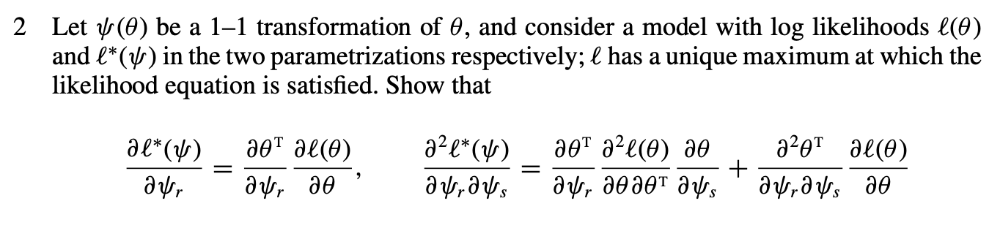
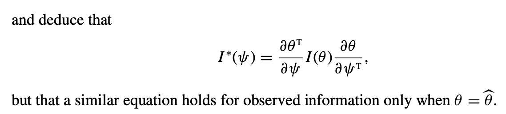
:::

::: {.callout-note collapse=true}
#### [Davison (2003), Exercise 8, pag. 109]{.blue}

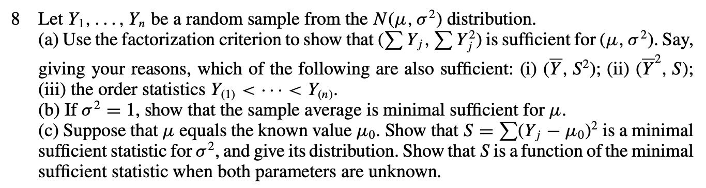
:::

::: {.callout-note collapse=true}
#### [Casella & Berger (2002), Exercise 7.6]{.orange}

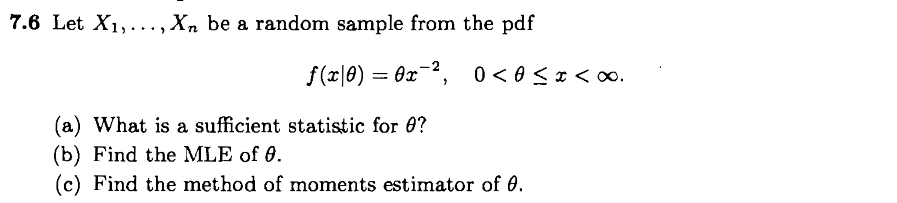
:::

::: {.callout-note collapse=true}
#### [Davison (2003), Problem 11, pag. 159]{.blue}

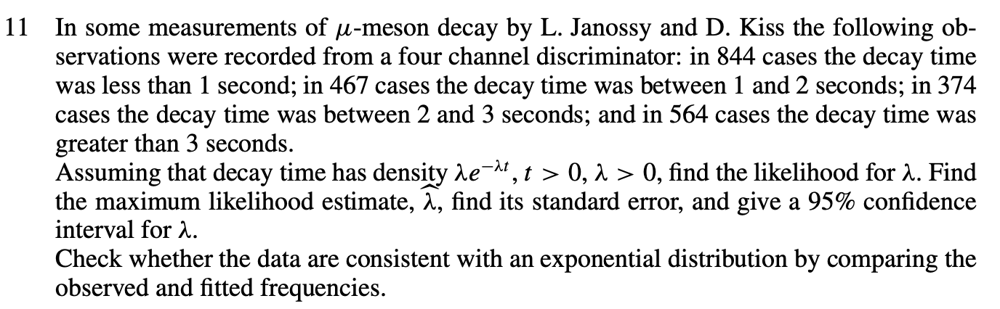
:::

::: {.callout-note collapse=true}
#### [Casella & Berger (2002), Exercise 7.10]{.orange}

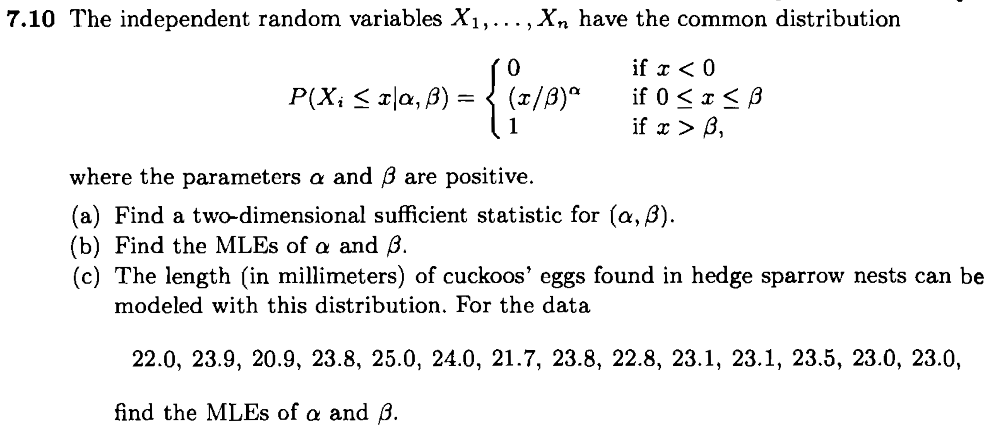
:::

## Risk, losses, Bayes estimation, and shrinkage

::: {.callout-note collapse=true}
#### [Casella & Berger (2002), Exercise 7.62]{.orange}

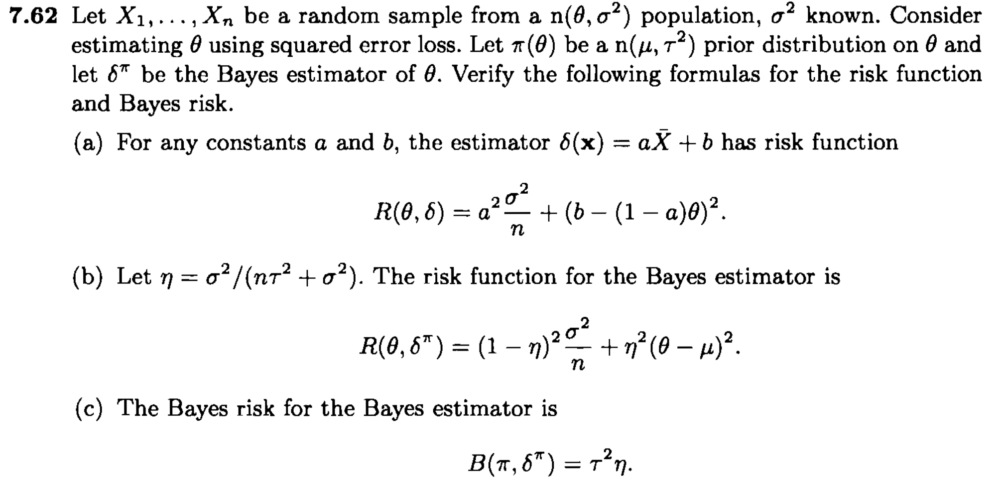
:::

::: {.callout-note collapse=true}
#### [Casella & Berger (2002), Exercise 7.63]{.orange}

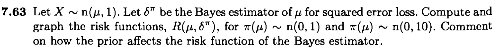
:::

::: {.callout-note collapse=true}
#### [Casella & Berger (2002), Exercise 7.65]{.orange}

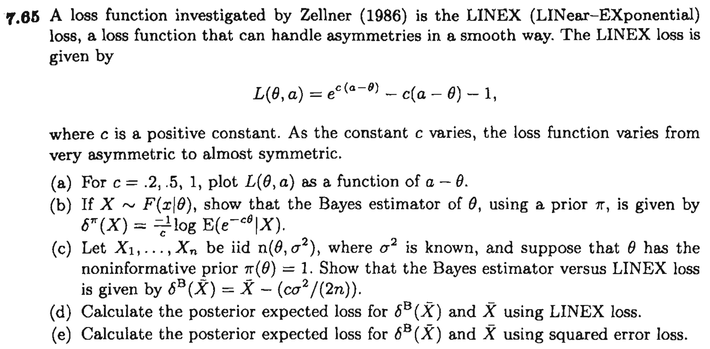
:::

::: {.callout-note collapse=true}
#### [Davison (2003), Problem 2, pag 636]{.blue}

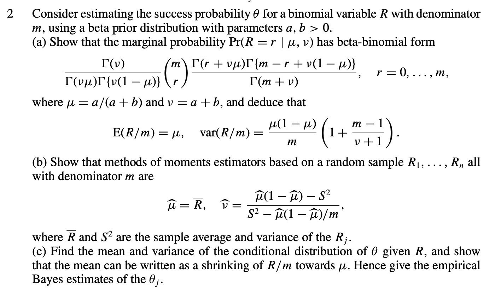
:::

## Unbiasedness and efficiency

::: {.callout-note collapse=true}
#### [Davison (2003), Problem 1, pag. 156]{.blue}

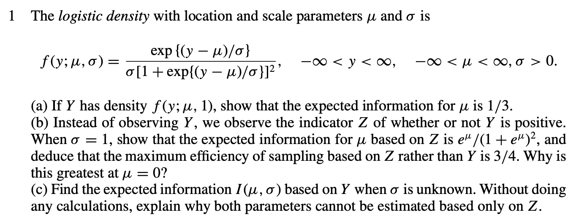
:::

::: {.callout-note collapse=true}
#### [Casella & Berger (2002), Exercise 7.44]{.orange}

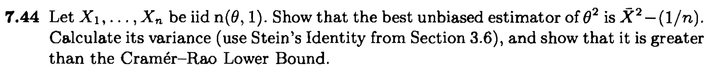
:::

::: {.callout-note collapse=true}
#### [Casella & Berger (2002), Exercise 7.46]{.orange}

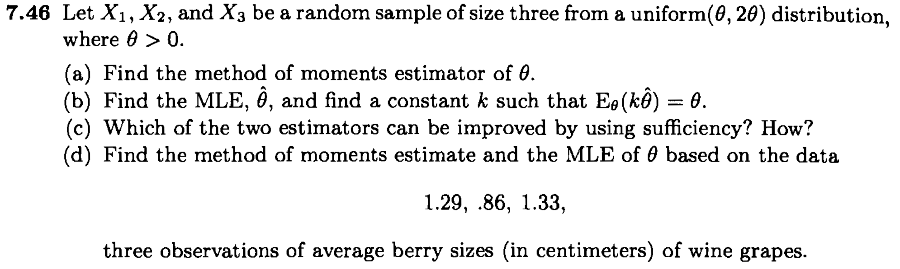
:::

::: {.callout-note collapse=true}
#### [Casella & Berger (2002), Exercise 7.48]{.orange}

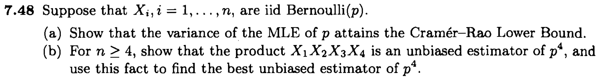
:::

::: {.callout-note collapse=true}
#### [Casella & Berger (2002), Exercise 7.57]{.orange}

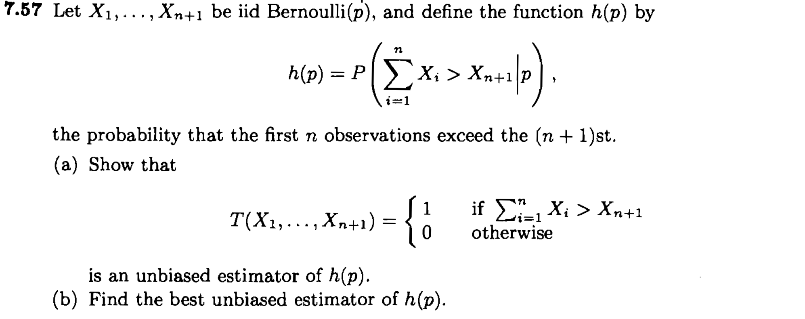
:::

::: {.callout-note collapse=true}
#### [Casella & Berger (2002), Exercise 7.66]{.orange}

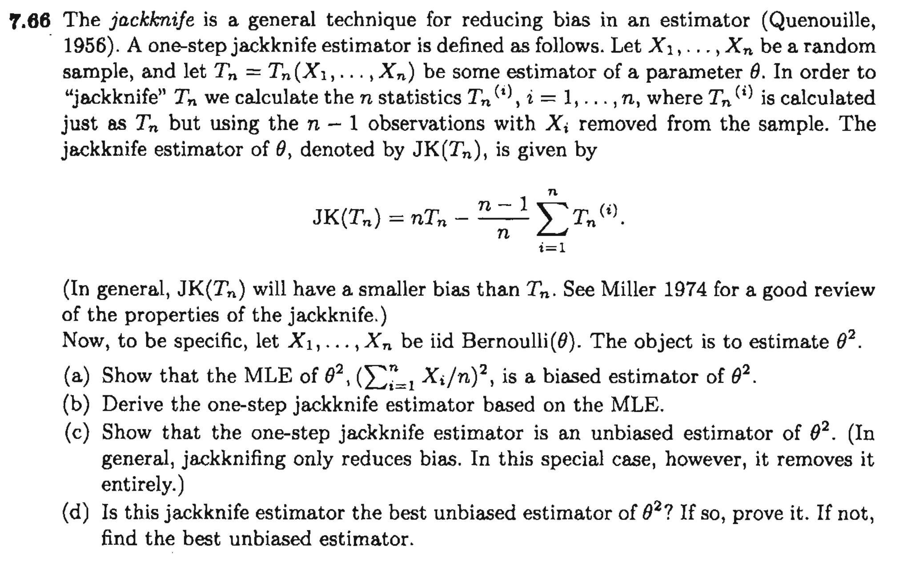
:::

## Asymptotics

::: {.callout-note collapse=true}
#### [Casella & Berger (2002), Exercise 10.9]{.orange}

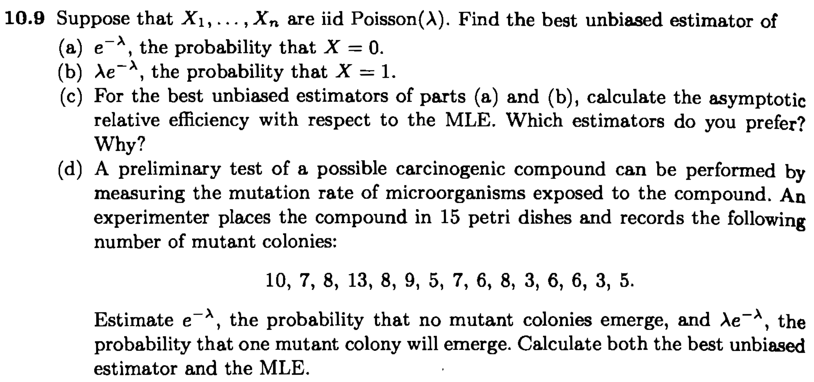
:::

::: {.callout-note collapse=true}
#### [Davison (2003), Exercise 5, pag. 125]{.blue}

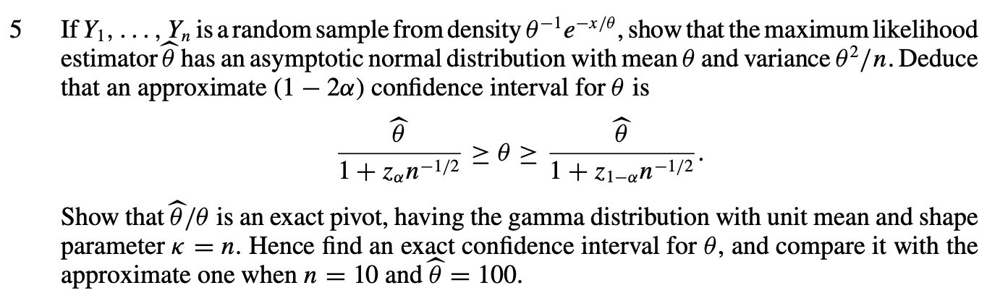
:::

::: {.callout-note collapse=true}
#### [Davison (2003), Exercise 5, pag. 149]{.blue}

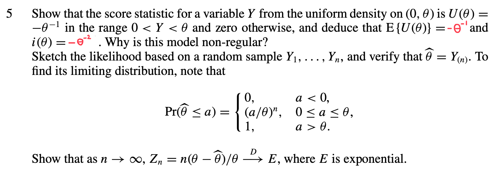
:::

::: {.callout-note collapse=true}
#### **Young and Smith (2008), Exercise 8.10, pag. 139**

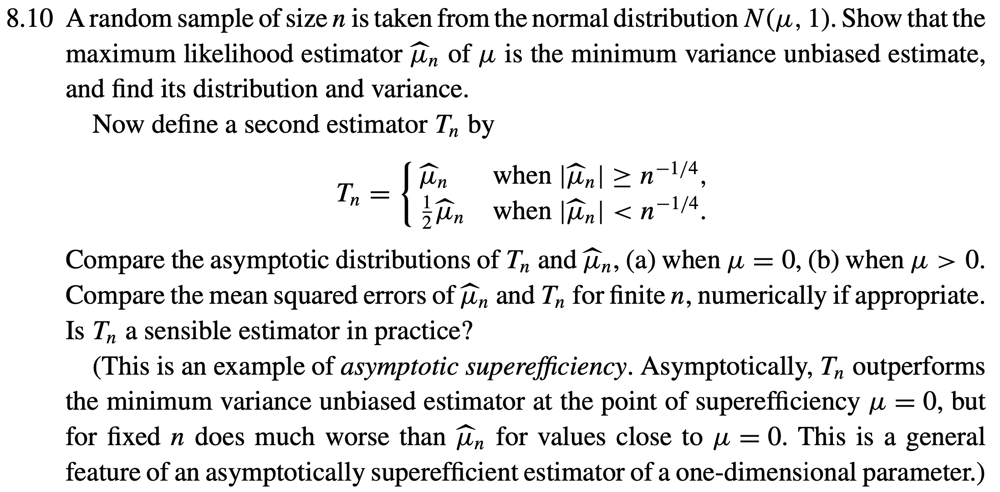
:::

## Robustness

::: {.callout-note collapse=true}
#### [Davison (2003), Exercise 2, pag. 324]{.blue}

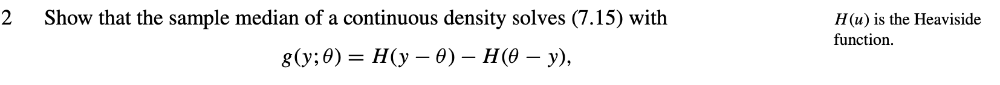
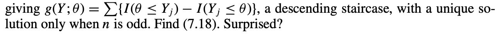

Recalling that

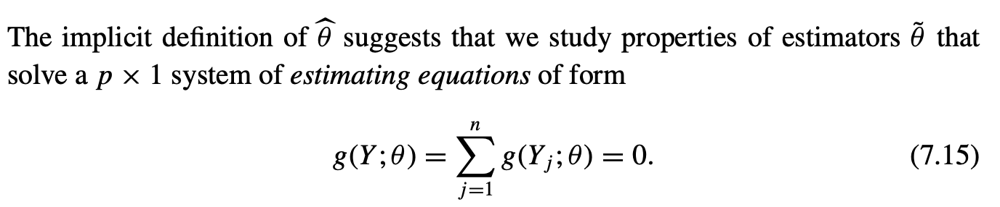

:::

::: {.callout-note collapse=true}
#### [Davison (2003), Exercise 6, pag. 325]{.blue}

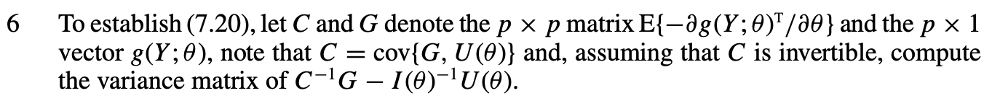

Recalling that

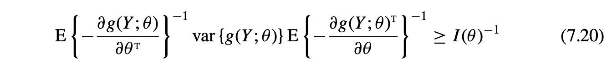
:::

<!-- Moderate and hard -->

<!-- An exercise about robustness and sandwich estimators is missing!! -->

<!-- - Casella & Berger (2002), Exercise 7.5. (More on the binomial example) -->
<!-- - Davison (2003), Exercise 1 pag. 156. (Weibull model, standard asymptotics) -->
<!-- - Davison (2003) Exercise 1, pag. 324. (Reparametrizations for M estimators) -->
<!-- - Casella & Berger (2002), Exercise 7.37. (Non-regular model, UMVUE estimator) -->
<!-- - Van der Vaart (2006), Exercise 1, pag. 40.  -->