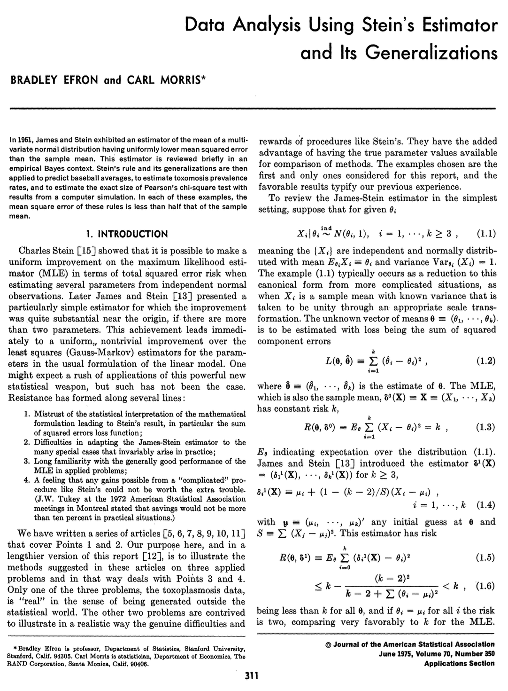

## [Homepage](../index.html)

```{r}
#| warning: false
#| echo: false
#| include: false
#| message: false
#| purl: false

knitr::purl("un_A.qmd", output = "../code/un_A.R", documentation = 0)
styler:::style_file("../code/un_A.R")

library(ggplot2)
library(ggthemes)
```

::: columns
::: {.column width="20%"}


<!-- *"Pluralitas non est ponenda sine necessitate."* -->

<!-- [William of Ockham]{.grey} -->
:::

::: {.column width="80%"}
- This unit will cover the following [topics]{.orange}:

    - Methods of finding estimators
    - Methods of evaluating estimators
    - Unbiasedness
    - Asymptotic evaluations
    - Robustness and model misspecification
:::

- The rationale behind [point estimation]{.blue} is quite simple:

- When sampling is from a [population]{.orange} described by a pdf or a pmf $f(\cdot ; \theta)$, knowledge of $\theta$ yields knowledge of the entire population.

- Hence, it is natural to seek a method of finding a good [estimator]{.blue} of the unknown point $\theta$.
:::

# Methods of finding estimators

## Estimator

::: callout-note
A [point estimator]{.blue} $\hat{\theta}$ is any function of the random sample $Y_1,\dots,Y_n$, namely $$
\hat{\theta}(\bm{Y}) = \hat{\theta}(Y_1,\dots,Y_n).
$$ That is, any [statistic]{.orange} is a point estimator.
:::

::: callout-tip

- To streamline the presentation, we consider estimators that target the [unknown parameter]{.orange} $\theta$ rather than an arbitrary (non-one-to-one) [transformation]{.blue} $g(\theta)$.  

- Most theoretical results [extend naturally]{.orange} to the general case $g(\theta)$. 

<!-- - In principle, the range of the estimator coincides with that of the parameter, i.e. $\hat{\theta} : \mathcal{Y} \rightarrow \Theta$, but there are exceptions. -->

:::


- An [estimator]{.blue} $\hat{\theta}(Y_1,\dots,Y_n)$ is a function of the sample $Y_1,\dots,Y_n$ and is a [random variable]{.blue}.

- An [estimate]{.orange} $\hat{\theta}(y_1,\dots,y_n)$ is a function of the realized values $y_1,\dots,y_n$ and is a [number]{.orange}.

- We will write $\hat{\theta}$ to denote both estimators and estimates whenever its meaning is clear from the context.

## Method of moments

- The [method of moments]{.blue} is, perhaps, the oldest method of finding point estimators, dating back at least to Karl Pearson in the late 1800s.

- Let $Y_1,\dots,Y_n$ be an iid sample from $f(\cdot; \theta)$,  $\theta = (\theta_1,\dots,\theta_p)$, and $\Theta \subseteq \mathbb{R}^p$. Moreover, define $$
    m_r = \frac{1}{n}\sum_{i=1}^n Y_i^r, \qquad \mu_r(\theta) = \mu_r(\theta_1,\dots,\theta_p) = \mathbb{E}_\theta(Y^r), \qquad r=1,\dots,p.
    $$ corresponding to the [population moment]{.blue} $\mu_r(\theta_1,\dots,\theta_p)$ and the [sample moment]{.orange} $m_r$.

- The method of moments estimator $\hat{\theta}$ is obtained by solving the following system of equations for $(\theta_1,\dots,\theta_p)$: $$
    \begin{aligned}
    \mu_1(\theta_1,\dots,\theta_p) &= m_1, \\
    \mu_2(\theta_1,\dots,\theta_p) &= m_2, \\
    &\vdots \\
    \mu_p(\theta_1,\dots,\theta_p) &= m_p. \\
    \end{aligned}
    $$

- In general, it is [not guaranteed]{.orange} that a [solution exists]{.blue} nor its [uniqueness]{.blue}.

## Asymptotic evaluation of the MM

-   Moments estimators are not necessarily the best estimators, but
    [under reasonable conditions]{.blue} they are [consistent]{.orange},
    they have converge rate $\sqrt{n}$, and they are [asymptotically
    normal]{.orange}.

-   Suppose $(Y,Y^2,\dots,Y^p)$ has [covariance]{.blue} $\Sigma$, then the
    multivariate [central limit theorem]{.orange} implies that as $n\rightarrow \infty$ $$
    \sqrt{n}\{m - \mu(\theta)\} \overset{d}{\longrightarrow} Z, \qquad Z\sim N_p(0, \Sigma),
    $$ where $m = (m_1,\dots,m_p)$ and
    $\mu(\theta) = (\mu_1(\theta),\dots,\mu_p(\theta))$.

-   Suppose also that $\mu(\theta)$ is a [one-to-one]{.blue} mapping and
    let $g(\mu)$ be the inverse of $\mu(\theta)$, that is
    $g = \mu^{-1}$. We assume that $g$ has [differentiable]{.blue}
    components $g_r(\cdot)$ for $r = 1,\dots,p$.

-   The moments estimator can be written as $\hat{\theta} = g(m)$ and
    $\theta = g(\mu(\theta))$. Then, as a consequence of the [delta
    method]{.orange}, the following general result holds: $$
    \sqrt{n}(\hat{\theta} - \theta) \overset{d}{\longrightarrow} Z, \qquad Z\sim N_p\left(0, D \Sigma D^T\right),
    $$ where $D = [d_{rr'}]$ is a $p \times p$ matrix whose entries are
    the derivatives $d_{rr'} = \partial g_r(\mu)/\partial \mu_{r'}$.

::: aside
Refer to @vandervaart1998, Theorem 4.1, pag. 35-36.
:::

## Example: beta distribution 📖 

-   Let $Y_1,\dots,Y_n$ be an iid random sample from a beta distribution
    of parameters $\alpha,\beta > 0$ with density $$
    f(y; \alpha, \beta) = \frac{\Gamma(\alpha + \beta)}{\Gamma(\alpha)\Gamma(\beta)} y^{\alpha-1}(1 - y)^{\beta-1}, \qquad 0 < y < 1.
    $$

-   The [moment estimator]{.blue} for $(\alpha, \beta)$ is the
    ([explicitly available]{.orange}) solution of the system of
    equations $$
    m_1 = \frac{\alpha}{\alpha + \beta}, \qquad m_2 = \frac{\alpha (\alpha+1)}{(\alpha + \beta) (\alpha + \beta + 1)}.
    $$

-   After some algebra we obtain the following relationship, which is a
    [smooth]{.orange} and [regular]{.orange} function of $(m_1,m_2)$: $$
    \hat{\alpha} = m_1 \frac{m_1 - m_2}{m_2 - m_1^2}, \qquad \hat{\beta} = (1 - m_1) \frac{m_1 - m_2}{m_2 - m_1^2}.
    $$ where $\hat{\sigma}^2 = m_2 - m_1^2$ is the [sample
    variance]{.blue}. [Remark]{.orange}: is it possible that $m_1 < m_2$?
    

## Example: beta distribution (food expenditure)

- We consider data on [proportion of income]{.orange} spent on [food]{.blue} for a random sample of $38$ households in a large US city.

```{r}
data("FoodExpenditure", package = "betareg")
FoodExpenditure$food <- FoodExpenditure$food /100
FoodExpenditure$Income <- factor(cut(FoodExpenditure$income, breaks = c(0, 50, 100)))
levels(FoodExpenditure$Income) <- c("Low", "High")

x <- FoodExpenditure$food[FoodExpenditure$Income == "Low"]
z <- FoodExpenditure$food[FoodExpenditure$Income == "High"]

m1_low <- mean(x)
m2_low <- mean(x^2)

alpha_low <- m1_low * (m1_low - m2_low) / (m2_low - m1_low^2)
beta_low <- (1 - m1_low) * (m1_low - m2_low) / (m2_low - m1_low^2)

m1_high <- mean(z)
m2_high <- mean(z^2)

alpha_high <- m1_high * (m1_high - m2_high) / (m2_high - m1_high^2)
beta_high <- (1 - m1_high) * (m1_high - m2_high) / (m2_high - m1_high^2)
```

::: callout-note
[Low]{.blue} income level ($n$ = `r length(x)`)
```{r}
print(x)
```
Here $m_1$ = `r round(m1_low, 3)` and $m_2$ = `r round(m2_low, 3)`, giving the [MM estimates]{.orange}: $\hat{\alpha}$ = `r round(alpha_low, 1)` and $\hat{\beta}$ = `r round(beta_low, 1)`. 
:::

:::callout-warning
[High]{.orange} income level ($n$ = `r length(z)`)

```{r}
print(z)
```
Here $m_1$ = `r round(m1_high, 3)` and $m_2$ = `r round(m2_high, 3)`, giving the [MM estimates]{.orange}: $\hat{\alpha}$ = `r round(alpha_high, 1)` and $\hat{\beta}$ = `r round(beta_high, 1)`. 

:::
    

## Example: beta distribution (food expenditure)

```{r}
#| fig-width: 9
#| fig-height: 5

ggplot(data = FoodExpenditure, aes(x = food, col = Income)) + geom_rug() + theme_light()  + theme(legend.position = "top") + scale_color_tableau(palette = "Color Blind") + xlab("Food expenditure (proportion)") + geom_function(fun = function(x) dbeta(x, alpha_low, beta_low), col = "#1170aa")+ geom_function(fun = function(x) dbeta(x, alpha_high, beta_high), col = "#fc7d0b") + xlim(c(0.02, 0.4)) + ylab("Density")
```

- [Estimated densities]{.orange} $f(y; \hat{\alpha}, \hat{\beta})$ for each income level, showing a reasonable fit in both cases. 

## Example: binomial with unknown trials MM 📖

- Let $Y_1,\dots,Y_n$ be iid $\textup{Bin}(N, p)$ and we assume that [both]{.orange} $N$ and $p$ are unknown. 

- This is a somewhat unusual application of the binomial model, which can be used e.g. to estimate crime rates for crimes that are known to have many unreported occurrences. 

- Equating the first two moments yields the system of equations
$$
m_1 = N p, \qquad m_2 = N p(1-p) + N^2p^2.
$$

- After some algebra we obtain the [moment estimator]{.blue} for $(N, p)$, which is  [smooth]{.orange} and [regular]{.orange} function of $(m_1,m_2)$:
$$
\hat{p} = \frac{m_1}{\hat{N}}, \qquad \hat{N} = \frac{m_1^2}{m_1 - \hat{\sigma}^2},
$$
where $\hat{\sigma}^2 = m_2 - m_1^2$ is the sample variance.

- [Remark]{.orange}: what if $m_1 < \hat{\sigma}^2$?

::: aside
This problem is described in Example 7.2.2 @Casella2002, pag. 313.
:::


## Maximum likelihood estimator

-   The method of [maximum likelihood]{.orange} is, by far, the most
    popular technique for deriving estimators, developed by [Ronald A.
    Fisher]{.blue} in Fisher (1922; 1925).

-   Recall that $L(\theta) = L(\theta; \bm{y})$ is the likelihood
    function and $\ell(\theta) = \log{L(\theta)}$ is the log-likelihood.

::: callout-note
Given a likelihood function $L(\theta)$ of $\theta \in \Theta$, a
[maximum likelihood estimate]{.orange} of $\theta$ is an element
$\hat{\theta} \in \Theta$ which attains the maximum value of $L(\theta)$
in $\Theta$, i.e. such that $L(\hat{\theta}) \ge L(\theta)$ or
equivalently $$
L(\hat{\theta}) = \max_{\theta \in \Theta} L(\theta).
$$

The [maximum likelihood estimator]{.blue} (MLE) of the parameter
$\theta$ based on a sample $\bm{Y}$ is $\hat{\theta}(\bm{Y})$.
:::

-   Intuitively, the MLE is a reasonable choice: it is the parameter
    point for which the observed sample is [most likely]{.blue}.

-   Clearly, the MLE is also the maximizer of the log-likelihood:
    $\ell(\hat{\theta}) = \max_{\theta \in \Theta} \ell(\theta)$.
    
## Properties and remarks about the MLE 📖 

-   [Remark I]{.blue}: the MLE may [not exists]{.orange} and is
    [not]{.orange} necessarily [unique]{.orange}. On the other hand, if $\Theta \subseteq \mathbb{R}^p$ and 
    $l(\theta)$ is differentiable, then it can be found as the solution
    of the [score equations]{.blue}: $$
    \ell^*(\theta) = \frac{\partial}{\partial \theta}\ell(\theta) = 0.
    $$

<!-- - If $s(y)$ is a [sufficient statistic]{.blue}, then the MLE is a function of it. -->

-   [Remark II]{.blue}: often $\hat{\theta}$ cannot be written
    explicitly as a function of the sample values, i.e. in general the
    MLE has [no closed-form expression]{.orange} but it must be found
    using [numerical procedures]{.orange}.

-   [Remark III]{.blue}: the likelihood function has to be maximized in
    the set space $\Theta$ specified by the statistical model, not over
    the set of the mathematically admissible values of $\theta$.

<!-- - [Remark IV]{.blue}: it is not necessary for $\Theta$ to be a numeric set, i.e. we need [not]{.orange} be dealing with a [parametric]{.orange} model, although we shall restrict ourself to this case. -->

::: callout-warning
#### Theorem [Invariance, @Casella2002, Theorem 7.2.10]

Let $\psi(\cdot)$ be [one-to-one]{.orange}[^invariance], that is, a [reparametrization]{.blue}, from the set $\Theta$ onto the set $\Psi$. Then the MLE of $\psi = \psi(\theta)$ is $\hat{\psi} = \psi(\hat{\theta})$ where $\hat{\theta}$ denotes the MLE of $\theta$.
:::

[^invariance]: It generalizes to any $g(\cdot)$. If $\hat{\theta}$ is the MLE, then $g(\hat{\theta})$ is the "MLE" of an "induced likelihood".


    
## Example: Poisson with unknown mean 📖 

-   Let $Y_1,\dots,Y_n$ be a iid random sample from a Poisson
    distribution of mean parameter $\lambda > 0$, with [likelihood
    function]{.orange} $$
    L(\lambda) = \prod_{i=1}^n \frac{e^{-\lambda} \lambda^{y_i}}{y_i!}.
    $$

-   Therefore the [log-likelihood]{.blue}, up to an additive constant
    $c$ not depending on $\lambda$, is $$
    \ell(\lambda) = \sum_{i=1}^ny_i\log{\lambda} - n\lambda + c.
    $$

-   The [maximum likelihood estimator]{.orange} $\hat{\lambda}$ is found
    by maximizing $\ell(\lambda)$. In this regular problem, this can be
    done by studying the first derivative: $$
    \ell^*(\lambda) = \frac{1}{\lambda}\sum_{i=1}^ny_i - n.
    $$

-   We solve $\ell^*(\lambda) = 0$, obtaining $\hat{\lambda} = \bar{y}$.
    This is indeed a maximizer of $\ell(\lambda)$ ([why]{.orange}?).


## Example: binomial with unknown trials MLE

- Let $Y_1,\dots,Y_n$ be iid $\textup{Bin}(N, p)$, and suppose $N$ is [unknown]{.orange}, while $p$ is considered [known]{.blue}. This constitutes a non-regular problem because $N$ is [discrete]{.blue}.

- The likelihood function is
$$
L(N) = \prod_{i=1}^n\binom{N}{y_i} p^{y_i}(1 - p)^{N - y_i},
$$
where the maximum [cannot]{.orange} be obtained through [differentiation]{.orange}, as $N \in \mathbb{N}$.

- Naturally, we require that $\hat{N} \ge \max_i y_i$, since $L(N) = 0$ for any $N < \max_i y_i$. The ML is therefore an integer $\hat{N} \ge \max_i y_i$ such that 
$$
L(\hat{N}) \ge L(\hat{N} - 1), \qquad L(\hat{N} + 1) < L(\hat{N}).
$$

- This value must be found [numerically]{.orange}. However, it can be shown[^3] that there exists exactly one such $\hat{N}$, meaning the MLE is [unique]{.blue}.

[^3]: This problem is described in Example 7.2.9 of @Casella2002, pag. 318.  See also Example 7.2.13: such estimate has a large variance in practice.

## Example: binomial with unknown trials MLE

- Let us consider the following data, in which both $N$ and $p$ are unknown. These are [simulated data]{.blue} and the [true values]{.grey} were $N = 75$ and $p = 0.32$. 

```{r}
x <- c(16, 18, 22, 25, 27)

m1 <- mean(x)
m2 <- mean(x^2)
sigma2 <- m2 - m1^2
N_mm <- m1^2 / (m1 - sigma2)
p_mm <- m1 / N_mm

N_seq <- 50:300
loglik <- numeric(length(N_seq))

for(i in 1: length(N_seq)){
  loglik[i] <- sum(dbinom(x, N_seq[i], prob = mean(x) / N_seq[i], log = TRUE))
}

N_MLE <- N_seq[which.max(loglik)]
p_MLE <- mean(x) / N_MLE
print(x)
```

- The [method of moments]{.orange} estimator gives $\hat{N}_\text{MM}$ = `r round(N_mm, 0)` (rounded to the closest integer) and $\hat{p}_\text{MM}$ = `r round(p_mm, 2)`. The [maximum likelihood]{.blue}, instead, gives $\hat{N}_\text{ML}$ = `r round(N_MLE, 2)` and $\hat{p}_\text{ML}$ = `r round(p_MLE, 2)`.

```{r}
#| fig-width: 9
#| fig-height: 5
#| fig-align: center

ggplot(data = data.frame(N = N_seq, loglik = loglik), aes(x = N, y = loglik)) +  theme_light() + xlab("N") + ylab("log-likelihood") + geom_point() + geom_vline(xintercept = N_MLE, linetype = "dashed")
```

- If we replace $27$ with a $28$, we obtain drastically different estimates, namely $\hat{N}_\text{MM} =  195$ and $\hat{N}_\text{ML} = 191$, demonstrating a [large]{.orange} amount of [variability]{.orange}.

## M-estimators

-   M- and Z- estimators are broad class of estimators that encompass
    the maximum likelihood (iid observations) and other popular methods
    as special cases. [^1]

[^1]: A detailed discussion is offered in @vandervaart1998, Chap. 5.

::: callout-note
An [M-estimator]{.blue} is the [maximizer]{.orange} over $\Theta$ of a
function $M(\theta) : \Theta \rightarrow \mathbb{R}$ of the type: $$
M(\theta) = \sum_{i=1}^n m(\theta; Y_i),
$$ where $m(\theta; Y_i)$ are known real-valued functions.
:::

-   [Remark]{.orange}: when $m(\theta; y) = \log{f(Y_i; \theta)}$ this
    coincides with the MLE of a model with iid observations.

<!-- -   The term $1/n$ is included here to facilitate the description of the -->
<!--     subsequent asymptotic theory, but it is obviously non influential. -->

## Z-estimators

::: callout-note
A [Z-estimator]{.blue} is the [solution]{.orange} over $\Theta$ of a
system of equations function $Q(\theta) = \bm{0}$ of the type: $$
Q(\theta) = Q(\theta; Y) = \sum_{i=1}^n q(\theta; Y_i) = \bm{0},
$$ where $q(\theta) = q(\theta; y)$ are known vector-valued maps. These are called [estimating equations]{.blue}.
:::

- When $\theta = (\theta_1,\dots,\theta_p)$, $Q$ and $q$ typically have $p$ coordinate functions, namely we consider:
$$
Q_r(\theta) = \sum_{i=1}^n q_r(\theta; Y_i)= 0, \qquad r = 1,\dots,p.
$$


- In many examples $q_r(y; \theta)$ are the partial derivatives of a function $m(\theta; y)$, that is $$
Q(\theta) = \frac{\partial}{\partial \theta} M(\theta).$$ 
An example is the [score function]{.blue} $\ell^*(\theta)$. However, this is [not always the case]{.orange}.

<!-- ## Plug-in estimators -->

## Huber estimators I

- The [location]{.orange} of a r.v. $Y$ is a vague term that can be made precise by defining it as the expectation $\mathbb{E}(Y)$, a quantile, or the center of symmetry, as in the following example.

- Let $Y_1,\dots,Y_n$ be a iid sample of real-valued random variables belonging to family of distributions $\mathcal{F}$ defined as
$$
\mathcal{F} = \{f(y - \theta) : \theta \in \Theta \subseteq \mathbb{R} \},
$$
for some unknown density $f(y)$ [symmetric]{.blue} around $0$. The parameter $\theta$ is the [location]{.orange}.

- Classical M- estimators for $\theta$ are the [mean]{.blue} and the [median]{.orange}, maximizing:
$$
-\sum_{i=1}^n (Y_i - \theta)^2, \quad (\text{Mean}) \qquad \qquad - \sum_{i=1}^n |Y_i - \theta|, \quad (\text{Median})
$$
or alternatively (Z- estimator forms) solving the equations
$$
\sum_{i=1}^n (Y_i - \theta) = 0, \quad (\text{Mean}) \qquad \qquad \sum_{i=1}^n \text{sign}(Y_i - \theta) = 0, \quad (\text{Median}).
$$

<!-- ## Location estimators II -->

<!-- - Both estimating equations involve functions of the form $q(\theta; Y) = q(Y - \theta)$ that are [monotone]{.blue} and [odd]{.orange} around zero.  -->

<!-- - It is hence reasonable to study estimating equations of the type:$$ -->
<!-- Q(\theta) = \frac{1}{n}\sum_{i=1}^n q(Y_i - \theta)= 0. -->
<!-- $$ -->
<!-- - This class of estimators has an appealing [equivariance]{.orange} property. If the observations $Y_i$ are shifted by a fixed amount $\alpha$, then so is the estimate: -->
<!-- $$ -->
<!-- \hat{\theta} + \alpha \quad \text{ solves } \quad Q(\theta) = \frac{1}{n}\sum_{i=1}^n q(Y_i + \alpha - \theta)= 0, -->
<!-- $$ -->
<!-- if $\hat{\theta}$ solves the original equation. -->


## Huber estimators II

- [Huber estimators]{.blue} can be regarded as a compromise between the mean and the median, maximizing the following function:
$$
M(\theta) = -\sum_{i=1}^n m(Y_i - \theta), \qquad m(y) = \begin{cases}\frac{1}{2}y^2 \quad &\text{ if } |y| \le k\\
k |y| - \frac{1}{2}k^2 \quad &\text{ if } |y| \ge k
\end{cases}
$$
where $k > 0$ is a [tuning]{.orange} parameter. The function $m(y)$ is continuous and differentiable[^2]. The choice $k \rightarrow 0$ leads to the median, whereas for $k \rightarrow \infty$ we get the mean.

- Equivalently, we can consider the solution of the following estimating equation:
$$
Q(\theta) = \sum_{i=1}^n q(Y_i - \theta)= 0, \qquad q(y) = \begin{cases} -k \quad &\text{ if }\: y \le -k\\
y \quad &\text{ if  }\: |y| \le k \\
k \quad &\text{ if }\: y \ge k\end{cases}
$$
- Unfortunately, there is no closed-form expression and the equation must be solved numerically. 

[^2]: See Exercise 10.28 of @Casella2002.


```{r}
#| message: false
#| purl: false
#| eval: false
set.seed(123)
library(MASS)
y <- c(rnorm(8), 3, 6, 9)

m_huber <- function(y, k) {
  0.5 * y^2 * I(abs(y) <= k) + (k * abs(y) - 0.5 * k^2) * I(abs(y) >= k)
}

M_huber <- function(theta, y, k) {
  -mean(m_huber(y - theta, k))
}
M_huber <- Vectorize(M_huber, vectorize.args = "theta")

k_values <- c(0.5, 1, 2, 4, 6, 8)
m_hat <- numeric(length(k_values))
for (i in 1:length(k_values)) {
  m_hat[i] <- nlminb(start = median(y), objective = function(theta) -M_huber(theta, y = y, k = k_values[i]))$par
  # Same thing, but numerically more stable because it is based on a better algorithm
  m_hat[i] <- huber(y, k = k_values[i] / 1.627587)$mu
}

```


## Example: Newcomb's speed of light

- Data $y_1, \dots, y_{66}$ represent Simon Newcomb's measurements (1882) of the [speed of light]{.orange}. The data are recordes as [deviations]{.blue} from 24,800 nanoseconds.

```{r}
library(BayesDA)
library(MASS)
data(light)
light_micro <- 0.001*light + 24.8
print(light)
```

- There are [two outliers]{.orange} (-44 and -2) which could influence the analysis. 

- We see that as $k$ increases, the [Huber estimate]{.blue} varies between the median (`r round(median(light), 2)`) and the mean (`r round(mean(light), 2)`), so we interpret increasing $k$ as decreasing [robustness]{.orange} to outliers.

- The suggested [default]{.blue} for $k$ is roughly $k \approx 4.5$, that is $k = 1.5 \times \text{MAD}$. 

```{r}
k_values <- c(5, seq(from = 10, to = 70, by = 10))
m_hat <- numeric(length(k_values))
for (i in 1:length(k_values)) {
  m_hat[i] <- huber(light, k = k_values[i] / 4.4478)$mu
}
tab <- c(median(light), m_hat)
names(tab) <- c(0, k_values)
# knitr::kable(t(tab), digits = 3)
```

| $k$ |  0|     5|     10|     20|     30|     40|     50|     60|     70|
|:--|--:|-----:|------:|------:|------:|------:|------:|------:|------:|
|Est. | 27| 27.37| 27.417| 27.125| 26.831| 26.677| 26.523| 26.369| 26.215|

- Based on recent measurements, the [true value]{.orange} of the speed of light, expressed in this scale, is 33. [Huber estimate]{.blue} for reasonable values of $k$ is [closer]{.blue} than both median and mean. 

## Bayesian estimators

- Bayesian estimators are obtained following a [different inferential paradigm]{.orange} than the one considered here, but they also exhibit [appealing frequentist properties]{.blue}.

- Let $L(\theta; \bm{y})$ denote the likelihood function, and let $\pi(\theta)$ represent the [prior]{.orange} distribution. Bayesian inference is based on the [posterior]{.blue} distribution, defined as:
$$
\pi(\theta \mid \bm{y}) = \frac{\pi(\theta) L(\theta; \bm{y})}{\int_\Theta \pi(\theta) L(\theta; \bm{y}) \mathrm{d}\theta}.
$$

- Under certain hypotheses, which will be clarified later, the [posterior mean]{.blue} serves as an [optimal Bayesian estimator]{.orange}:
$$
\hat{\theta}_\text{Bayes} = \mathbb{E}(\theta \mid \bm{Y}) = \frac{\int_\Theta \theta \: \pi(\theta) L(\theta; \bm{Y}) \mathrm{d}\theta}{\int_\Theta \pi(\theta) L(\theta; \bm{Y}) \mathrm{d}\theta}.
$$
However, this estimator is not always available in closed form.

- Other "optimal" Bayesian estimators include, for instance, the posterior median.

## Example: binomial Bayes estimator

- Let $Y_1,\dots,Y_n$ be iid Bernoulli random variables with probability $p$, and let the prior $p \sim \text{Beta}(a, b)$. Moreover, let $n_1 = \sum_{i=1}^n y_i$ be the [number of successes]{.blue} out of $n$ trials.

- Standard calculations in Bayesian statistics yield the ([conjugate]{.orange}) posterior $(p \mid Y_1,\dots,Y_n) \sim \text{Beta}(a + n_1, b + n - n_1)$. Hence, the [posterior mean]{.blue} is
$$
\hat{p} = \mathbb{E}(p \mid Y_1,\dots,Y_n) = \frac{a + n_1}{a + b + n}.
$$

- Note that we can rewrite $\hat{p}$ in the following way:
$$
\hat{p} = \left(\frac{n}{a + b + n}\right)\bar{y} + \left(\frac{a + b}{a + b + n}\right) \left(\frac{a}{a + b}\right),
$$
that is, as a [linear combination]{.orange} of the prior mean and the sample mean, with weights determined by $a, b$, and $n$.[^4]

[^4]: This is not a coincidence, and it essentially holds for general exponential families; see the elegant paper by @Diaconis1979.


# Methods of evaluating estimators

## Comparing estimators

- We study the performance of estimators, aiming to determine when an estimator $\hat{\theta}$ can be considered [good]{.orange} or [optimal]{.blue}. 

- This requires [criteria]{.orange} for evaluation, often provided by [decision theory]{.blue}, which relies on a [loss function]{.orange} $\mathscr{L}$. The function $\mathscr{L}(\theta, \hat{\theta})$ quantifies the loss incurred when estimating $\theta$ by $\hat{\theta}$.

- Typically, we assume 
$$
\mathscr{L}(\theta, \theta) = 0 \text{ (no loss for the correct estimate)}, \qquad \mathscr{L}(\theta, \hat{\theta}) \geq 0,
$$  for all $\theta$ and $\hat{\theta}$.

::: callout-note
Since $\hat{\theta}(\bm{Y})$ is random, we need a way to summarize the loss. A common criterion is the (frequentist) [risk function]{.orange}, namely the [average loss]{.blue}, defined as the expectation
$$
R(\theta; \hat{\theta}) = \mathbb{E}_\theta\{\mathscr{L}(\theta, \hat{\theta}(\bm{Y}))\}.
$$
:::

## Optimal estimators

- An [oracle estimator]{.blue} $\hat{\theta}_\text{oracle}$, which never makes errors, satisfies $$
R(\theta; \hat{\theta}_\text{oracle}) = 0,
$$ for all $\theta \in \Theta$. Clearly, such an estimator [does not exist]{.orange}.

- An [optimal estimator]{.blue} $\hat{\theta}_\text{opt}$ [uniformly]{.blue} minimizes the risk, meaning 
$$
R(\theta; \hat{\theta}_\text{opt}) \leq R(\theta; \tilde{\theta}),
$$ for all $\theta \in \Theta$ and estimators $\tilde{\theta}$. Except for trivial cases, such an estimator [does not exist]{.orange} unless one [restricts]{.blue} the class of estimators considered [^5].

- In fact, the constant estimator $\hat{\theta}_\text{const}(\bm{Y}) = \theta_1$ has zero risk when $\theta = \theta_1$ but positive risk otherwise. Thus, $\hat{\theta}_\text{opt}$ would need $R(\theta; \hat{\theta}_\text{opt}) = 0$ for all $\theta \in \Theta$, making it identical to the oracle.

[^5]: A common restriction is unbiasedness, namely the requirement $\mathbb{E}_\theta(\hat{\theta}) = \theta$. An alternative restriction is equivariance. 

## Admissible estimators


::: callout-note
An estimator $\hat{\theta}$ is [admissible]{.orange} if no other estimator $\tilde{\theta}$ exists such that  
$$
R(\theta; \tilde{\theta}) \le R(\theta; \hat{\theta}), \qquad \text { for all } \theta \in \Theta,
$$
with strict inequality for at least one value of $\theta$.
:::

- Broadly speaking, an [admissible]{.blue} estimator $\hat{\theta}$ will perform better than an alternative $\tilde{\theta}$ for some values of $\theta$ and worse for others.

- In principle, disregarding any practical implications, an [inadmissible]{.orange} estimator should not be used, as it is [dominated]{.orange} by a better alternative.

- The admissibility criterion is interesting due to its [selective]{.blue} nature, eliminating dominated estimators. 

- However, [admissibility]{.blue} alone is [not enough]{.orange}: for instance, the constant estimator $\hat{\theta}_\text{const} = \theta_1$ is admissible but clearly unsatisfactory.

## The choice of the loss function

- The choice of the loss function has its roots in [decision theory]{.blue}. The loss function $\mathscr{L}$ is a nonnegative function that generally increases as the distance between $\hat{\theta}$ and $\theta$ increases.

- Let $\theta \in \mathbb{R}^p$. Two [commonly used]{.orange} loss functions are
$$
\mathscr{L}(\theta, \hat{\theta}) = ||\hat{\theta} - \theta||_1, \qquad \text{(Absolute error loss)},
$$
and  
$$
\mathscr{L}(\theta, \hat{\theta}) = ||\hat{\theta} - \theta||_2^2, \qquad \text{(Quadratic loss)}.
$$  

- The quadratic loss is the de facto standard in many contexts, leading to the [mean squared error]{.orange} and the well-known [bias-variance]{.blue} decomposition. Let $\Theta \subseteq \mathbb{R}$, then  
$$
R(\theta; \hat{\theta}) = \mathbb{E}_\theta\{(\hat{\theta} - \theta)^2\} = \text{bias}_\theta(\hat{\theta})^2 + \text{var}_\theta(\hat{\theta}), \qquad \text{(Mean squared error)}.
$$  

- Both these losses are [convex]{.blue}, and the quadratic loss is [strictly convex]{.orange}. Convexity will be crucial in the subsequent theoretical developments.  

## Other loss functions

- In principle, the choice of the loss should be based on its properties rather than mathematical convenience. Here we present some less common [examples]{.orange}. 

- [Weighted quadratic loss]{.blue}, a variant of the quadratic loss, accounting for weights. Let $\theta \in \mathbb{R}^p$
$$
\mathscr{L}(\theta, \hat{\theta}) = (\theta - \hat{\theta})^T A (\theta - \hat{\theta}),
$$
where $A \in \mathbb{R}^{p \times p}$ is a positive definite matrix. This loss is [strictly convex]{.orange}.

- [Stein Loss]{.blue} [^6]. Let $\theta > 0$, such as the [population variance]{.orange} of a model. Stein loss is defined as: 
$$
\mathscr{L}(\theta,\hat{\theta}) = \frac{\hat{\theta}}{\theta} - 1 - \log\frac{\hat{\theta}}{\theta}.
$$
A criticism of quadratic loss for variance estimation is that underestimation has finite penalty, while overestimation as infinite penalty. Instead, Stein loss $\mathscr{L}(\theta,\hat{\theta}) \rightarrow \infty$ as $\hat{\theta}\rightarrow 0$ and $\hat{\theta}\rightarrow \infty$. 

- Other examples are [Huber losses]{.blue} [see @Lehmann1998, pp. 51-52] and [intrinsic losses]{.blue} [see @Robert1994, 2.5.4], such as the [entropy distance]{.orange}.

[^6]: See Examples 7.3.26 and 7.3.27 in @Casella2002 for a comparison in the estimation of the population variance $\sigma^2$ under the quadratic loss and the Stein loss. 

## Example: MSE of binomial estimators I  📖

- Let $Y_1,\dots,Y_n$ be iid Bernoulli random variables with probability $p$. Moreover, let $n_1 = \sum_{i=1}^n y_i$ be the [number of successes]{.blue} out of $n$ trials.

- The [proportion]{.orange} $\hat{p} = \bar{y} = n_1/n$ is the [maximum likelihood]{.orange} (and method of moments) estimator. Simple calculations yield 
$$
R(p; \hat{p}) = \mathbb{E}_p\{(\hat{p} - p)^2\} = \text{var}_p(\hat{p}) = \frac{p(1-p)}{n}.
$$

- Let us consider a [Bayesian estimator]{.blue} for $p$ under a beta prior with parameters $a = b = 0.5\sqrt{n}$, yielding
$$
\hat{p}_\text{minimax} = \frac{n_1 + 0.5\sqrt{n}}{n + \sqrt{n}}, \qquad R(p; \hat{p}_\text{minimax}) = \mathbb{E}_p\{(\hat{p}_\text{minimax} - p)^2\} = \frac{n}{4 ( n + \sqrt{n})^2}.
$$
This Bayesian estimator has [constant risk]{.orange}, that is, $R(p; \hat{p}_\text{minimax})$ does not depend on $p$.[^7]  

[^7]: Some subjective Bayesians may criticize this estimator for not being "truly Bayesian" as the hyperparameters depend on the sample size $n$, making the prior data-dependent. However, here we are evaluating $\hat{p}_\text{Bayes}$ from a frequentist perspective.

## Example: MSE of binomial estimators II

```{r}
#| fig-width: 9
#| fig-height: 5


n <- 4
data_plot <- data.frame(p = rep(seq(from = 0, to = 1, length = 1000), 2))
data_plot$n <- "Sample size (n) = 4"
data_plot$MSE <- c(data_plot$p[1:1000] * (1 - data_plot$p[1:1000]) / n, data_plot$p[1:1000] * 0 + n / (4 * (n + sqrt(n))^2))
data_plot$Estimator <- rep(c("Maximum likelihood", "Minimax"), each = 1000)

n <- 4000
data_plot2 <- data.frame(p = rep(seq(from = 0, to = 1, length = 1000), 2))
data_plot2$n <- "Sample size (n) = 4000"
data_plot2$MSE <- c(data_plot2$p[1:1000] * (1 - data_plot2$p[1:1000]) / n, data_plot2$p[1:1000] * 0 + n / (4 * (n + sqrt(n))^2))
data_plot2$Estimator <- rep(c("Maximum likelihood", "Minimax"), each = 1000)

data_plot <- rbind(data_plot, data_plot2)

ggplot(data = data_plot, aes(x = p, y = MSE, col = Estimator)) +
  geom_line() +
  facet_wrap(.~n, scales = "free_y") + 
  theme_light() +
  theme(legend.position = "top") +
  scale_color_tableau(palette = "Color Blind") +
  xlab("p") +
  ylab("MSE")
```


## Example: MSE of binomial estimators III

- Neither $\hat{p}$ dominates $\hat{p}_\text{minimax}$ nor vice versa. In fact, both estimators are [admissible]{.blue}.  

- For small values of $n$, $\hat{p}_\text{minimax}$ is the [better choice]{.orange} unless one believes that $p$ is very close to one of the extremes $0$ or $1$.  

- Conversely, for large values of $n$, the maximum likelihood estimator $\hat{p}$ is the better choice unless one strongly believes that $p$ is very close to $0.5$.  

- This information, [combined]{.blue} with the [knowledge of the problem ]{.blue} at hand, can lead to choosing the better estimator for the situation.  

::: callout-tip
- We will get back to this example, as both $\hat{p}$ and $\hat{p}_\text{minimax}$ are [optimal]{.blue} in some sense.  

- In fact, $\hat{p}$ is the [UMVU estimator]{.orange} (uniform minimum variance unbiased estimator), and $\hat{p}_\text{minimax}$ is the [minimax]{.orange} estimator.  
:::

## James-Stein estimator I

- Let $\bm{Y} = (Y_1,\dots,Y_p)$ be a [Gaussian random vector]{.blue}, $\bm{Y} \sim \text{N}_p(\mu, I_p)$, with unknown means $\mu = (\mu_1,\dots,\mu_p)$ and fixed variance. That is,
$$
  Y_j \overset{\text{ind}}{\sim} \text{N}(\mu_j, 1), \qquad j=1,\dots,p.
$$

- We are interested in [estimating]{.orange} the [means]{.orange} $\mu$.

::: callout-tip
- Intuitively, the most "natural" approach is the maximum likelihood / method of moments estimator, which in this case with $n = 1$ is simply
$$
  \hat{\mu}_j = Y_j, \qquad j=1,\dots,p.
$$
- This estimator is "optimal" in the sense that it is the UMVUE, as we shall see in the next sections. Moreover, its [frequentist risk]{.orange} under a squared loss is
  $$
  R(\mu; \hat{\mu}) = \mathbb{E}_\mu(||\hat{\mu} - \mu||_2^2) = p,
  $$
  because $||\hat{\mu} - \mu||_2^2 = ||\bm{Y} - \mu||_2^2 \sim \chi^2_p$.
:::

## James-Stein estimator II

- By the early 1950s, three proofs had emerged to show that $\hat{\mu}$ is [admissible]{.blue} for squared error loss [when]{.orange} $p = 1$.

- Nevertheless, @Stein1956[^8] [stunned the statistical world]{.blue} when he proved that although $\hat{\mu}$ is admissible for squared error loss when $p = 2$, it is [inadmissible]{.orange} [when]{.orange} $p \geq 3$.

- In fact, @James1961[^9] showed that the estimator  
  $$
  \hat{\mu}_\text{JS} = \left(1 - \frac{p-2}{||\bm{Y}||_2^2}\right)\bm{Y}
  $$
  strictly [dominates]{.orange} $\hat{\mu}$.

[^8]: @Stein1956, Inadmissibility of the usual estimator of the mean of a multivariate normal distribution, *Proc. Third Berkeley Symposium*, 1, 197–206, Univ. California Press.

[^9]: @James1961, Estimation with quadratic loss, *Proc. Fourth Berkeley Symposium*, 1, 361–380, Univ. California Press.

## James-Stein estimator III  📖

::: callout-warning
#### Theorem (James-Stein, 1961)
Let $\bm{Y} \sim \text{N}_p(\mu, I_p)$. The frequentist risk of the James-Stein estimator $\hat{\mu}_\text{JS}$ under quadratic loss is 
$$
R(\mu; \hat{\mu}_\text{JS}) = \mathbb{E}_\mu(||\hat{\mu}_\text{JS} - \mu||_2^2) = p - (p -2)^2\mathbb{E}_\mu\left(\frac{1}{||\bm{Y}||_2^2}\right).
$$
Thus, $\hat{\mu}_\text{JS}$ [strictly dominates]{.blue} $\hat{\mu}$, meaning that $R(\mu; \hat{\mu}_\text{JS}) < R(\mu; \hat{\mu}) = p$. Moreover,
$$
R(\mu; \hat{\mu}_\text{JS}) \le p - \frac{(p-2)^2}{p - 2 + ||\mu||_2^2}.
$$
:::

- Geometrically, the James-Stein estimator [shrinks]{.orange} each component of $\bm{Y}$ towards the origin.

- The biggest [improvement]{.blue} occurs when $\mu$ is close to zero. For $\mu = 0$, we have $R(0; \hat{\mu}_\text{JS}) = 2$ for all $p \geq 2$. As $||\mu||_2^2 \rightarrow \infty$, the risk approaches $R(\mu; \hat{\mu}_\text{JS}) \rightarrow p$.  

## James-Stein estimator IV

<!-- - The James-Stein estimator is also [inadmissible]{.orange}. Note that $(1 - (p-2)/||\bm{Y}||_2^2)$ can be negative. Using its positive part, $(1 - (p-2)/||\bm{Y}||_2^2)_+$, gives a [uniformly better]{.blue} (inadmissible!) estimator.   -->

- A useful [generalization]{.orange} of the [James-Stein estimator]{.blue} consists in [shrinking]{.orange} the mean towards a [common value]{.blue} $m \in \mathbb{R}$ rather than $0$, giving
$$
  \hat{\mu}_\text{JS}(m) = m + \left(1 - \frac{p-2}{||\bm{Y} - m||_2^2}\right)(\bm{Y} - m).
$$
It holds that $R(\mu; \hat{\mu}_\text{JS}(m)) \le p - (p-2)^2/ (p - 2 + ||\mu - m||_2^2)$, therefore $\hat{\mu}_\text{JS}(m)$ [dominates]{.blue} $\hat{\mu}$.

- Even better, if we [estimate]{.orange} $m$ with the [arithmetic mean]{.blue} of $\bm{Y}$, that is $\bar{Y} = (1/p) \sum_{j=1}^p Y_j$, we can obtain the following [shrinkage estimator]{.orange}:
$$
  \hat{\mu}_\text{shrink} = \bar{Y} + \left(1 - \frac{p-3}{||\bm{Y} - \bar{Y}||_2^2}\right)(\bm{Y} - \bar{Y}).
$$
Intuitively, $p-3$ is the appropriate constant as an additional parameter is estimated. Moreover, in @Efron1975 it is proved that 
$$
R(\mu; \hat{\mu}_\text{shrink}) \le p - \frac{(p-3)^2}{p - 3 + ||\mu - \bar{\mu}||_2^2},
$$ 
with $\bar{\mu} = (1/p)\sum_{j=1}^p\mu_j$, again [dominating]{.blue} the maximum likelihood $\hat{\mu}$.

## James-Stein estimator V

::: callout-tip
The James-Stein estimator is an empirical [Bayes estimator]{.blue} in disguise. Let $\bm{Y} \sim \text{N}_p(\mu, I_p)$ and consider the [prior]{.orange} $\bm{\mu} \sim N_p(m, \tau^2 I_p)$. Then the [posterior mean]{.orange} is
$$
\hat{\mu}_\text{Bayes} = m + \left(1 - \frac{1}{1 + \tau^2}\right)(\bm{Y} - m).
$$
James-Stein is an [empirical Bayes]{.blue} approach: the quantity $1/(1 + \tau^2)$ is [estimated]{.orange}.
:::


- In particular, under the Bayesian model
$$
||\bm{Y} - m||_2^2 = \sum_{j=1}^p(Y_j - m)^2 \sim (1 + \tau^2)\chi^2_p
$$
and therefore $(p - 2)/(||\bm{Y} - m||_2^2)$ is an an [unbiased estimate]{.orange} for $1 / (1 + \tau^2)$. In fact:
$$
\mathbb{E}\left(\frac{p - 2}{||\bm{Y} - m||_2^2}\right) = \frac{1}{1 + \tau^2}.
$$

- Alternative estimates for $1/(1 + \tau^2)$ leads to [refined]{.blue} James-Stein estimators.

## Efron and Morris (1975)

::: columns
::: {.column width="35%"}

:::

::: {.column width="65%"}
- @Efron1975 [JASA]{.blue} is a [classical paper]{.blue} on the [practical relevance]{.orange} of James-Stein's estimator.  

- This approach was used in [sports analytics]{.orange} to predict the batting averages of 18 major league players in 1970.  

- As expected, [shrinkage estimators]{.blue} significantly improve upon the maximum likelihood estimator.  

- Stein's estimator was $3.50$ times [more efficient]{.orange} than the MLE in this case.  

- It also showcases a useful practical demonstration of [variance-stabilizing]{.orange} transformations: 
  - The original data are proportions, i.e. arguably not Gaussians.
  - After a suitable transformations they can be approximately regarded as normal. 

:::

:::

## Efron and Morris (1975)

:::{.smaller}
```{r}
baseball <- read.table("../data/efron-morris-75-data.tsv", header = TRUE)
baseball <- baseball[, c(1:5, 7)]

p_hat <- baseball$BattingAverage
q_hat <- sqrt(baseball$At.Bats) * asin(2 * p_hat - 1)

q_JS <- mean(q_hat) + (1 - (length(q_hat) - 3) / sum((q_hat - mean(q_hat))^2)) * (q_hat - mean(q_hat))

p_JS <- (sin(q_JS / sqrt(baseball$At.Bats)) + 1) / 2

baseball$JS <- p_JS
colnames(baseball) <- c("First name", "Last name", "At Bats", "Hits", "Average (MLE)", "Remaining average", "James-Stein")
# knitr::kable(baseball[c(1:4, 15:18), c(1:5, 7,6)], row.names = F, digits = 3)
```

|Name  | At Bats $n_i$ | Hits $x_i$ |  Mean $\hat{p_i}$ | James-Stein| Rem. mean|
|:---|---------------:|-------------:|-----------------:|----------------:|---------------:|
|Clemente   |      45|   18|         0.400|       0.290|             0.346|
|Robinson   |      45|   17|         0.378|       0.286|             0.298|
|Howard     |      45|   16|         0.356|       0.282|             0.276|
|Johnstone  |      45|   15|         0.333|       0.277|             0.222|
| ... | | | | | |
|Williams   |      45|   10|         0.222|       0.254|             0.330|
|Campaneris |      45|    9|         0.200|       0.249|             0.285|
|Munson     |      45|    8|         0.178|       0.244|             0.316|
|Alvis      |      45|    7|         0.156|       0.239|             0.200|

:::

- The batting averages $\hat{p}_i$ out of $n_i$ trials for $n = 18$ players have been [transformed]{.orange} via $y_i = \sqrt{n_i} \arcsin(2 p_i - 1)$. The [James-Stein estimator]{.blue} is applied to $y_i$ and then transformed back.  

- The [shrinkage effect]{.orange} is evident and provides a better estimate of the [remaining batting average]{.blue} for the season.  


## James-Stein estimator VI

- James-Stein estimators were initially seen with suspicion:  
  - How come that deliberately introducing [bias]{.orange} improves the estimates?  
  - How come that [learning from the experience of other]{.orange} points can modify and even improve the individual estimates?  

- These ideas are nowadays well established:  
  - Modern [shrinkage estimators]{.blue} such as [ridge regression]{.orange} and [lasso]{.orange} are widely used.  
  - The notion of [borrowing of information]{.blue} is at the heart of [random effects models]{.blue}.  

- The James-Stein theorem rigorously confirms the theoretical relevance of [indirect information]{.blue}. Remarkably, this is based on [frequentist criteria]{.orange} rather than Bayesian ones.  

- A [simple proof]{.blue} of the James-Stein theorem can be found in @Efron2010; see also @Efron2016 for a modern and accessible perspective or  [this divulgative article](https://www.statslab.cam.ac.uk/~rjs57/SteinParadox.pdf).  

## Criticism to the risk function approach

- Some authors, such as @Robert1994, have [criticized]{.orange} the risk function approach for comparing estimators. The main arguments are the following:  

:::callout-tip
- The frequentist paradigm evaluates estimators based on their [long-run performance]{.blue}, without accounting for the given observations $\bm{Y}$. A client may wish for [optimal results]{.blue} for the observed data, and [not someone else's data]{.orange}.  

- The risk function approach implicitly assumes the [repeatability]{.blue} of the [experiment]{.blue}, which has sparked controversy, especially among Bayesian statisticians. 

- For instance, if new observations come to the statistician, she should make use of them, potentially modifying the way the experiment is conducted, as in medical trials.  

- The risk function depends on $\theta$, preventing a [total ordering]{.blue} of the estimators. Comparisons are difficult unless a [uniformly optimal]{.blue} procedure exists, which is [rare]{.orange}.
:::

## Integrated risk

- Let us begin by finding a criterion that induces [total ordering]{.orange} among estimators. A potential solution is taking the [average]{.blue} risk function over values of $\theta$.  

::: callout-note
Let $R(\theta, \hat{\theta}) = \mathbb{E}_\theta\{\mathscr{L}(\theta,\hat{\theta})\}$ be the [risk function]{.orange}, and let $\pi(\mathrm{d}\theta)$ be a probability measure [weighting]{.orange} the relevance of each $\theta$. Then  
$$
r(\pi, \hat{\theta}) = \int_\Theta R(\theta; \hat{\theta}) \pi(\mathrm{d}\theta),
$$
is called [integrated risk]{.blue} or [Bayes risk]{.orange}.  
:::  

- Thus, an estimator $\hat{\theta}$ is [preferable]{.blue} over another $\tilde{\theta}$ if $r(\pi, \hat{\theta}) < r(\pi, \tilde{\theta})$. Moreover, if $\hat{\theta}$ [dominates]{.orange} $\tilde{\theta}$, that is if $\tilde{\theta}$ is [inadmissible]{.orange}, then $r(\pi, \hat{\theta}) < r(\pi, \tilde{\theta})$ for any choice of weights. 

## Example: integrated risk of binomial estimators 📖

- Let us consider the estimation of the [probability]{.blue} $p$ from a [binomial experiment]{.binomial} using the maximum likelihood  $\hat{p} = n_1/n$ and the Bayesian $\hat{p}_\text{minimax} = (n_1 + 0.5\sqrt{n})/(n + \sqrt{n})$ estimators.  

- We previously computed the [mean squared error]{.orange} for both estimators. Let us now compute the integrated risk, assuming [uniform weights]{.blue} $\pi(\mathrm{d}p) = \mathrm{d}p$, i.e., a [simple average]{.orange} of the MSE.  

- The [integrated risk]{.blue} of the [maximum likelihood]{.orange} estimator is  
$$
r(\pi, \hat{p}) = \int_0^1 \mathbb{E}_p\{(\hat{p} - p)^2\}\mathrm{d}p = \frac{1}{n}\int_0^1 p(1-p)\mathrm{d}p= \frac{1}{6n}.
$$  

- The [integrated risk]{.blue} of the [Bayes estimator]{.orange} coincides with the risk function, the latter being [constant]{.orange} over $p$:  
$$
r(\pi, \hat{p}_\text{minimax}) = \int_0^1 \mathbb{E}_p\{(\hat{p}_\text{minimax} - p)^2\}\mathrm{d}p = \int_0^1\frac{n}{4 ( n + \sqrt{n})^2}\mathrm{d}p= \frac{n}{4 ( n + \sqrt{n})^2}.
$$  

- Depending on the sample size $n$, one estimator may be preferable over the other.  

## Example: integrated risk of binomial estimators

```{r}
#| fig-width: 9
#| fig-height: 5
#| fig-align: center

data_plot <- data.frame(n = rep(round(seq(from = 3, 50, length = 5000)), 2))
data_plot$BayesRisk <- c(1 / (6 * data_plot$n[1:5000]),  data_plot$n[1:5000] / (4 * (data_plot$n[1:5000] + sqrt(data_plot$n[1:5000]))^2))
data_plot$Estimator <- rep(c("Maximum likelihood", "Minimax"), each = 5000)

ggplot(data = data_plot, aes(x = n, y = BayesRisk, col = Estimator)) +
  geom_line() +
  theme_light() +
  theme(legend.position = "top") +
  scale_color_tableau(palette = "Color Blind") +
  xlab("n") +
  ylab("Integrated risk (Bayes risk)")
```

- According to the integrated risk and using constant weights $\pi(\mathrm{d}p) = \mathrm{d}p$ one should [prefer]{.orange} $\hat{p}$ over $\hat{p}_\text{minimax}$ when $n \ge 20$ and viceversa.  

## Bayesian estimators minimize the integrated risk 📖

- The integrated risk is a sensible criterion for comparing estimators, provided a suitable set of weights $\pi$ is selected. Hence, we may wish to find its [minimizer]{.orange}. 

- There is a surprisingly simple and elegant answer to this apparently difficult question.

::: callout-warning
#### Theorem (@Lehmann1998, Theorem 1.1 in Chap. 4)
Let $\pi(\mathrm{d}\theta)$ be the [prior distribution]{.orange} for $\theta$. The [minimizer]{.orange} of the [posterior expected loss]{.blue}, if a unique solution exists, is called [Bayes estimator]{.blue}. Moreover:
$$
\hat{\theta}_\text{Bayes}(\bm{Y}) = \arg\min_{\tilde{\theta} \in \Theta} \int_\Theta \mathscr{L}(\theta, \tilde{\theta}(\bm{Y}))\pi(\mathrm{d}\theta \mid \bm{Y}) = \arg\min_{\tilde{\theta} \in \Theta} r(\pi, \tilde{\theta}(\bm{Y})),
$$
which means $\hat{\theta}_\text{Bayes}$ coincides with minimizer of the [integrated risk]{.orange}, provided $r(\pi, \hat{\theta}_\text{Bayes}) < \infty$.
:::

- This fundamental theorem provides a [decision-theoretic justification]{.blue} to Bayesian estimators as well as a practical recipe for finding them. 

## Decision-theoretic justification of the posterior mean 📖

::: callout-warning
#### Corollary (@Robert1994, Proposition 2.5.1)
Let $\Theta \subseteq \mathbb{R}^p$, then the [Bayes estimator]{.blue} associated with prior distribution $\pi$ and [quadratic loss]{.blue} $\mathscr{L}(\theta, \hat{\theta}) = ||\hat{\theta} -\theta||_2^2$ is the [posterior mean]{.orange}:
$$
\hat{\theta}_\text{Bayes}(\bm{Y}) = \arg\min_{\tilde{\theta} \in \Theta} \int_\Theta ||\tilde{\theta}(\bm{Y}) - \theta||_2^2\pi(\mathrm{d}\theta \mid \bm{Y}) = \mathbb{E}(\theta \mid \bm{Y}).
$$
If the posterior mean exists, the Bayes estimator is [unique]{.blue}.
:::

- Hence, the [posterior mean]{.orange} is [optimal]{.blue} in the sense that minimizes the posterior expected loss and therefore also the integrated risk. 

-	This theorem extends to various loss functions. For instance if $\mathscr{L}(\theta, \hat{\theta}) = ||\hat{\theta} - \theta||_1$ then the [Bayes estimator]{.blue} is the [posterior median]{.orange}.


## Example: integrated risk of binomial estimators 📖

- We previously considered the estimators $\hat{p} = n_1/n$ and $\hat{p}_\text{minimax} = (n_1 + 0.5\sqrt{n})/(n + \sqrt{n})$. Assuming [uniform weights]{.blue}, neither $\hat{p}$ nor $\hat{p}_\text{minimax}$ minimizes the integrated risk.  

- In fact, theoretical results indicate that the [unique minimizer]{.blue} is the [posterior mean]{.orange} of $p$ for a binomial model under a [uniform prior]{.orange} $\pi(\mathrm{d}p) = \mathrm{d}p$. The optimal estimator is:
$$
p \mid \bm{Y} \sim \text{Beta}(n_1 + 1, n - n_1 + 1) \implies \hat{p}_\text{Bayes} = \mathbb{E}(p \mid \bm{Y}) = \frac{n_1 + 1}{n + 2}.
$$  

- After some simple but tedious calculations, we obtain the associated [mean squared error]{.orange}:  
$$
R(p; \hat{p}_\text{Bayes}) = \left(\frac{2}{n+2}\right)^2(1/2 - p)^2 + \left(\frac{n}{n+2}\right)^2 \frac{p(1-p)}{n}. 
$$  

- Integrating with respect to the [uniform prior]{.blue} distribution, we obtain the [integrated risk]{.orange}:
$$
r(\pi, \hat{p}_\text{Bayes}) = \int_0^1 R(p; \hat{p}_\text{Bayes})\mathrm{d}p = \frac{1}{6 (n+2)},
$$
which is indeed [smaller]{.orange} than $r(\pi, \hat{p})$ and $r(\pi, \hat{p}_\text{minimax})$.

## Example: integrated risk of binomial estimators

```{r}
#| fig-width: 9
#| fig-height: 5
#| fig-align: center

data_plot <- data.frame(n = rep(round(seq(from = 3, 50, length = 5000)), 3))
data_plot$BayesRisk <- c(1 / (6 * data_plot$n[1:5000]),  data_plot$n[1:5000] / (4 * (data_plot$n[1:5000] + sqrt(data_plot$n[1:5000]))^2), 1 / (6 * (data_plot$n[1:5000] + 2)))
data_plot$Estimator <- rep(c("Maximum likelihood", "Minimax", "Bayes"), each = 5000)

ggplot(data = data_plot, aes(x = n, y = BayesRisk, col = Estimator)) +
  geom_line() +
  theme_light() +
  theme(legend.position = "top") +
  scale_color_tableau(palette = "Color Blind") +
  xlab("n") +
  ylab("Integrated risk (Bayes risk)")
```

## Admissibility of Bayesian estimators 📖

- The next theorem provides a strong [frequentist justification]{.orange} for [Bayesian estimators]{.blue}.  

::: callout-warning
#### Theorem (@Lehmann1998, Theorem 2.4 in Chap. 5)  
Any unique Bayesian estimator is [admissible]{.blue}.  
:::

- The uniqueness assumption is a technical condition often satisfied in practice. Under [squared loss]{.blue}, or any other strictly convex loss, this holds automatically, provided the [estimator exists]{.orange}.

- If the loss is strictly convex, such as the squared error loss, and the integrated risk is finite, this theorem remains valid even when using [improper priors]{.orange} (@Robert1994, Proposition 2.4.25).

- [Admissibility]{.blue} is a [minimum requirement]{.orange}: even constant estimators are admissible.

- Nonetheless, the risk function approach dictates that inadmissible estimators should be discarded. This is non-trivial in practice, as evidenced by the James-Stein saga.  

## Minimax estimators

- The [minimax]{.blue} criterion is an alternative to the integrated risk for [discriminating]{.orange} among (admissible) [estimators]{.blue}. It comes from game theory, where two adversaries are competing.

- Instead of considering the "average" risk over $\theta$ (integrated risk), the minimax criterion evaluates the [risk function]{.blue} of estimators in the [worst-case scenario]{.orange}.

::: callout-note
An estimator $\hat{\theta}_\text{minimax}$ which [minimizes]{.blue} the [maximum]{.orange} risk, that is, which satisfies
$$
\sup_{\theta \in \Theta} R(\theta; \hat{\theta}_\text{minimax}) =\inf_{\hat{\theta}} \sup_{\theta \in \Theta} R(\theta; \hat{\theta}),
$$
is called [minimax estimator]{.orange}. The quantity $\sup_\theta R(\theta; \hat{\theta}_\text{minimax})$ is called [minimax risk]{.blue}.
:::

- In general, [finding minimax]{.orange} estimators is [difficult]{.orange}. Moreover, the resulting estimators are not necessarily very appealing in practice. 

## Example: MSE of binomial estimators (minimax)

```{r}
#| fig-width: 9
#| fig-height: 5
#| fig-align: center
library(ggplot2)
library(ggthemes)

n <- 100
data_plot <- data.frame(p = rep(seq(from = 0, to = 1, length = 1000), 2))
data_plot$n <- "Sample size (n) = 100"
data_plot$MSE <- c(data_plot$p[1:1000] * (1 - data_plot$p[1:1000]) / n, data_plot$p[1:1000] * 0 + n / (4 * (n + sqrt(n))^2))
data_plot$Estimator <- rep(c("Maximum likelihood", "Minimax"), each = 1000)

n <- 10000
data_plot2 <- data.frame(p = rep(seq(from = 0, to = 1, length = 1000), 2))
data_plot2$n <- "Sample size (n) = 10000"
data_plot2$MSE <- c(data_plot2$p[1:1000] * (1 - data_plot2$p[1:1000]) / n, data_plot2$p[1:1000] * 0 + n / (4 * (n + sqrt(n))^2))
data_plot2$Estimator <- rep(c("Maximum likelihood", "Minimax"), each = 1000)

data_plot <- rbind(data_plot, data_plot2)

ggplot(data = data_plot, aes(x = p, y = MSE, col = Estimator)) +
  geom_line() +
  facet_wrap(.~n, scales = "free_y") + 
  theme_light() +
  theme(legend.position = "top") +
  scale_color_tableau(palette = "Color Blind") +
  xlab("p") +
  ylab("MSE")
```

- We will show that $\hat{p}_\text{minimax} = (n_1 + 0.5\sqrt{n})/(n + \sqrt{n})$ is indeed the [minimax estimator]{.orange}. However, this is a very [conservative]{.blue} choice. 

- One could argue that the maximum likelihood $\hat{p} = n_1/n$ is the preferred choice in practice, especially when $n$ is large enough, even though it has slightly higher risk when $p \approx 1/2$. 

<!-- ## Minimax and Bayesian estimators -->

<!-- :::callout-note -->
<!-- #### Least favorable prior -->
<!-- Let $\hat{\theta}_\text{Bayes}$ and $\tilde{\theta}_\text{Bayes}$ be [optimal Bayes estimators]{.orange} for a given model under [prior]{.orange} distributions $\pi(\mathrm{d}\theta)$ and $\tilde{\pi}(\mathrm{d}\theta)$, respectively. We will say  $\pi(\mathrm{d}\theta)$ is [least favorable]{.blue} if its itegrated risk -->
<!-- $$ -->
<!-- r(\pi, \hat{\theta}_\text{Bayes}) = \int_\Theta R(\theta; \hat{\theta}_\text{Bayes})\pi(\mathrm{d}\theta) \ge \int_\Theta R(\theta; \tilde{\theta}_\text{Bayes})\tilde{\pi}(\mathrm{d}\theta) = r(\tilde{\pi}, \tilde{\theta}_\text{Bayes}). -->
<!-- $$ -->
<!-- for any other prior distribution $\tilde{\pi}(\mathrm{d}\theta)$.  -->
<!-- ::: -->

<!-- ::: callout-warning -->
<!-- #### Lemma (@Robert1994, Lemma 2.4.10) -->

<!-- Let $\pi(\mathrm{d}\theta)$ be the [least favorable]{.blue}  prior. Then the integrated risk is smaller than the minimax risk: -->
<!-- $$ -->
<!-- r(\pi, \hat{\theta}_\text{Bayes}) \le \inf_{\hat{\theta}} \sup_{\theta \in \Theta} R(\theta; \hat{\theta}) \le \sup_{\theta \in \Theta} R(\theta; \hat{\theta}_\text{Bayes}). -->
<!-- $$ -->
<!-- Clearly, the same hold for any other prior choice $\tilde{\pi}$.  -->
<!-- ::: -->


## Minimax and Bayesian estimators 📖

:::callout-warning
#### Theorem (@Lehmann1998, Theorem 1.4, Chap. 5)
Let $\pi(\mathrm{d}\theta)$ be a prior distribution and $\hat{\theta}_\text{Bayes}$ be the [unique Bayes]{.blue} estimator. If it holds
$$
r(\pi, \hat{\theta}_\text{Bayes}) = \sup_\theta R(\theta; \hat{\theta}_\text{Bayes}),
$$
then:

- the Bayes estimator $\hat{\theta}_\text{Bayes}$ is also the [unique minimax]{.orange} estimator.

- the prior $\pi(\mathrm{d}\theta)$ is [least favorable]{.blue}, meaning that $r(\pi, \hat{\theta}_\text{Bayes})\ge r(\tilde{\pi}, \tilde{\theta}_\text{Bayes})$ for any other prior $\tilde{\pi}(\mathrm{d}\theta)$ and Bayes estimator $\tilde{\theta}_\text{Bayes}$. 
:::

- [Remark]{.orange}. The above condition states the average of $R(\theta; \hat{\theta}_\text{Bayes})$ is equal to its maximum. This will be the case when the risk function [constant]{.orange} over $\theta$. 

- More generally, if an [admissible estimator]{.blue} has [constant risk]{.orange}, is the unique [minimax]{.orange} estimator (@Robert1994, Proposition 2.4.21). 

# Unbiasedness

## Unbiased estimators

:::callout-note
An estimator $\hat{\theta}$ is [unbiased]{.blue} for $\theta$ if $\mathbb{E}_\theta(\hat{\theta}) = \theta$, that is, if $\text{bias}_\theta(\hat{\theta}) = \mathbb{E}_\theta(\hat{\theta} - \theta) = 0$ for all $\theta \in \Theta$.
:::

- We often teach that [unbiasedness]{.orange} is a natural and appealing property of an estimator. If $\Theta \subseteq \mathbb{R}$ and under [squared error loss]{.blue}, unbiasedness implies that  
  $$R(\theta;\hat{\theta}) = \mathbb{E}_\theta\{(\hat{\theta} - \theta)^2\} = \text{var}_\theta(\hat{\theta}).$$

- There are two main reasons for emphasizing unbiasedness:
  - It is often possible to find the uniformly "best" unbiased estimator, e.g., the one with the lowest variance ([UMVU estimator]{.orange}).
  - For an estimator to be [consistent]{.grey}, it must be at least [asymptotically unbiased]{.blue}.

:::callout-tip
Unbiasedness is not a negative property per se. However, one may overlook better estimators by focusing too narrowly on this special class. Indeed, the [UMVUE]{.blue} can even be [inadmissible]{.orange}.
:::

## Nonexistence of unbiased estimators

- Certain quantities [do not admit unbiased]{.orange} estimators, even though they can be accurately estimated using [slightly biased]{.blue} estimators.

- Let $Y \sim \text{Bin}(n, p)$ and suppose we wish to find an estimator $\hat{\psi}(Y)$ for the reparametrization $\psi = 1 / p$. Then unbiasedness of an estimator $\hat{\psi}(Y)$ would require
$$
\sum_{k=0}^n \hat{\psi}(k)\binom{n}{k}p^k(1-p)^{n -k} = \frac{1}{p}, \qquad p \in (0, 1).
$$
Such an estimator [does not exist]{.orange}!

- Indeed, the left hand side of this equation is a [polynomial]{.blue} $p$ with degree at most $n$. However, $1/p$ cannot be written as a polynomial.

- Nonetheless, the [slightly biased]{.blue} estimator $\hat{\psi} = n / n_1$ will be close to $1/p$ with high probability as $n$ increases. 

## Bayesian estimators and unbiasedness 📖

:::callout-warning
#### Theorem (@Lehmann1998, Theorem 2.3, Chap. 4)

Let $\Theta \subseteq \mathbb{R}^p$ and $\hat{\theta}_\text{Bayes}(\bm{Y})$ be the unique Bayes estimator with prior $\pi$ under a [squared error loss]{.orange}. If $\hat{\theta}_\text{Bayes}$ is [unbiased]{.blue} then its integrated risk is
$$
r(\pi, \hat{\theta}_\text{Bayes}) = 0.
$$
:::

- The above theorem is a formal way of saying that, apart from trivial cases, posterior means are  [never unbiased]{.orange} estimators.

- However, the [bias]{.orange} comes with a [reduced variance]{.blue}, therefore the trade-off could be favorable. This is guaranteed to occur because Bayesian estimators are admissible.

- Moreover, under mild regularity conditions, Bayesian estimators are [asymptotically unbiased]{.blue}.

## Example: Poisson unbiased estimation

- Let $Y_1,\dots,Y_n$ be i.i.d. $\text{Poisson}(\lambda)$, and let
$\bar{Y} = n^{-1} \sum_{i=1}^n Y_i$ and $S^2 = (n-1)^{-1} \sum_{i=1}^n (Y_i - \bar{Y})^2$ be the [sample mean]{.blue} and [sample variance]{.orange}, respectively.  

- It can be shown[^mean_variance] that both estimators are [unbiased]{.orange}, meaning
$$
\mathbb{E}(\bar{Y}) = \mathbb{E}(S^2) = \lambda, \quad \text{for all } \lambda.
$$

- To determine which estimator, $\bar{Y}$ or $S^2$, is preferable, we should [compare their variances]{.blue}. It is also well known that $\text{var}_\lambda(\bar{Y}) = \lambda / n$, whereas computing $\text{var}_\lambda(S^2)$ can be [lengthy]{.orange}.  

- It holds that $\text{var}_\lambda(\bar{Y}) < \text{var}_\lambda(S^2)$ for all $\lambda$. This implies that $S^2$ is [inadmissible]{.orange}. 

- However, we can construct [infinitely]{.blue} many [unbiased estimators]{.blue} of $\lambda$:
$$
\hat{\lambda}_a = a \bar{Y} + (1 - a) S^2, \quad 0 < a < 1.
$$
Is there a value of $a$ such that $\text{var}_\lambda(\hat{\lambda}_a) \leq \text{var}_\lambda(\bar{Y})$? What about other unbiased estimators?


[^mean_variance]: These are basic and well-known results: see Theorem 5.2.6 in @Casella2002.

## UMVU estimators

:::callout-tip
In this subsection on [unbiasedness]{.orange}, we will often assume that $\Theta \subseteq \mathbb{R}$. All the results presented here extend to the [vector case]{.blue}, though at the cost of heavier notation.
:::

:::callout-note
Let $\Theta \subseteq \mathbb{R}$. An estimator $\hat{\theta}$ is a [best unbiased estimator]{.blue} of $\theta$ if it satisfies $\mathbb{E}_\theta(\hat{\theta}) = \theta$ for all $\theta$ (unbiasdness) and, for any [other unbiased]{.orange} estimator $\tilde{\theta}$, we have
$$
\text{var}_\theta(\hat{\theta}) \le \text{var}_\theta(\tilde{\theta}), \qquad \text {for all } \theta \in \Theta.
$$
The estimator $\hat{\theta}$ is also called [uniform minimum variance unbiased estimator]{.orange} (UMVUE) of $\theta$. 
::::

- The UMVUE [does not necessarily exist]{.orange}. If it does, [finding it]{.blue} is not easy. And even if a unique UMVUE exists, it could still be [inadmissible]{.orange}--recall the James-Stein saga.

- The success of UMVUE estimators is tied to two illuminating and elegant theorems: [Cramér-Rao]{.blue} and [Rao-Blackwell]{.orange}, which connect likelihood theory, sufficiency, and unbiasedness.

## Cramér-Rao inequality 📖

- The Cramér-Rao theorem establishes a [lower bound]{.blue} for the variance of an estimator. Thus, if the variance of an unbiased estimator $\hat{\theta}$ attains the lower bound for all $\theta$, then $\hat{\theta}$ is [UMVUE]{.orange}.

::: callout-warning
#### Theorem (Cramér-Rao, Theorem 7.3.9 in @Casella2002)
Let $Y_1,\dots,Y_n$ be a sample from a joint probability measure $f(\bm{y} \mid \theta)\nu(\mathrm{d}\bm{y})$ and let $\Theta \subseteq \mathbb{R}$. Moreover, let $\hat{\theta}(\bm{Y})$ be an estimator of $\theta$ satisfying
$$
1 + b^*(\theta) := \frac{\partial}{\partial \theta}\int \hat{\theta}(\bm{y})f(\bm{y} \mid \theta)\nu(\mathrm{d}\bm{y}) = \int \frac{\partial}{\partial \theta} \hat{\theta}(\bm{y})f(\bm{y} \mid \theta)\nu(\mathrm{d}\bm{y}),
$$
and with finite variance $\text{var}(\hat{\theta}(\bm{Y})) < \infty$. Then
$$
\text{var}(\hat{\theta}(\bm{Y})) \ge \frac{[1 + b^*(\theta)]^2}{\mathbb{E}_\theta(\ell^*(\theta)^2)}.
$$
Moreover, if $\hat{\theta}$ is an [unbiased]{.orange} estimator for $\theta$, then $b^*(\theta) = 0$ and  $\text{var}(\hat{\theta}(\bm{Y})) \ge 1/\mathbb{E}_\theta(l^*(\theta)^2)$ . 
:::

## Cramér-Rao: considerations

:::callout-tip
- The interchange of the derivative under the integral sign is an important [condition]{.orange}, not merely a technical artifact of the proof.

- For example, if the [sample space]{.blue} of i.i.d. random variables $Y_i$ [depends on $\theta$]{.blue}, such condition is violated, and the Cramér-Rao lower bound may not hold.[^uniform_example]
:::

- The Cramér-Rao inequality is sometimes called [information inequality]{.orange}. In fact $I(\theta)$ defined as: 
$$
I(\theta) := \mathbb{E}_\theta(\ell^*(\theta)^2),
$$
is called [Fisher information]{.blue} or information number. This reflects the fact that as more information become available, the bound on the variance gets smaller.

:::callout-tip
If $W(\bm{Y})$ is an unbiased estimator of a [transformation]{.blue} $g(\theta)$, then the Cramér-Rao theorem holds as stated, but the term $\frac{\partial}{\partial \theta}\mathbb{E}_\theta(W(\bm{Y})) = 1 + b^*(\theta)$ is not related to the "bias".  
:::

[^uniform_example]: See Example 7.3.13 in @Casella2002, for a simple and illuminating example.

## Bartlett identities I 📖

:::callout-warning
#### First Bartlett identity
Let $Y_1,\dots,Y_n$ be a sample from a joint probability measure $f(\bm{y} \mid \theta)\nu(\mathrm{d}\bm{y})$ and let $\Theta \subseteq \mathbb{R}$. If we can interchange derivation and integration, namely
$$\frac{\partial}{\partial \theta}\int f(\bm{y} \mid \theta)\nu(\mathrm{d}\bm{y}) = \int \frac{\partial}{\partial \theta} f(\bm{y} \mid \theta)\nu(\mathrm{d}\bm{y}), \tag{C.1}
$$
then 
$$
\mathbb{E}_\theta(\ell^*(\theta)) = 0,\qquad \text{implying}\qquad  I(\theta) = \mathbb{E}_\theta(\ell^*(\theta)^2) = \text{var}_\theta(\ell^*(\theta)).
$$
:::

- Thus, the regularity condition of Cramér-Rao implies that the score function $\ell^*(\theta)$ is un [unbiased estimating equation]{.blue}. 

## Bartlett identities II 📖

:::callout-warning
#### Second Bartlett identity
Let $Y_1,\dots,Y_n$ be a sample from a joint probability measure $f(\bm{y} \mid \theta)\nu(\mathrm{d}\bm{y})$ and let $\Theta \subseteq \mathbb{R}$. If we can interchange [twice]{.orange} derivation and integration, namely
$$
\frac{\partial}{\partial \theta}\int f(\bm{y} \mid \theta)\nu(\mathrm{d}\bm{y}) = \int \frac{\partial}{\partial \theta} f(\bm{y} \mid \theta)\nu(\mathrm{d}\bm{y}), \tag{C.1}
$$
$$
\frac{\partial^2}{\partial \theta^2}\int f(\bm{y} \mid \theta)\nu(\mathrm{d}\bm{y}) = \int \frac{\partial^2}{\partial \theta^2}f(\bm{y} \mid \theta)\nu(\mathrm{d}\bm{y}), \tag{C.2}
$$
then
$$
I(\theta) = \mathbb{E}_\theta(\ell^*(\theta)^2) =\text{var}_\theta(\ell^*(\theta))= \mathbb{E}_\theta\left(-\frac{\partial^2}{\partial \theta^2}\ell(\theta)\right).
$$
:::

- Both conditions are true in [regular exponential]{.orange} families. This also clarifies that, in regular models, Fisher information relates to the [curvature]{.blue} of the log-likelihood. 

## Cramér-Rao: iid and regular case 📖

::: callout-warning
#### Theorem (Cramér-Rao, simplified)
Let $Y_1,\dots,Y_n$ be an iid sample from $f(y \mid \theta)\mathrm{d}y$ satisfying conditions [C.1]{.blue} and [C.2]{.blue}, and let $\Theta \subseteq \mathbb{R}$. Moreover, let $\hat{\theta}(\bm{Y})$ be an [unbiased]{.orange} estimator of $\theta$  with finite variance $\text{var}(\hat{\theta}(\bm{Y})) < \infty$. Then
$$
\text{var}_\theta(\hat{\theta}(\bm{Y})) \ge \frac{1}{n i(\theta)}, \qquad i(\theta) = -\int\frac{\partial^2}{\partial \theta^2}\log{f(y \mid \theta)}\mathrm{d}y.
$$
:::

- The Fisher information is the [sum]{.blue} of [individual contributions]{.blue} $I(\theta) = i(\theta) + \cdots + i(\theta) = n i(\theta)$. 

- It can be shown[^CramerRao_exponential] that [attainment]{.blue}, that is the equality $\text{var}(\hat{\theta}(\bm{Y})) = 1/ni(\theta)$, occurs if and only if $f(y \mid \theta)$ is the density of an [exponential family]{.orange}.

[^CramerRao_exponential]: See Theorem 5.12, Chap.2, @Lehmann1998.

## Example: Poisson unbiased estimation 📖

- Let $Y_1,\dots,Y_n$ be i.i.d. $\text{Poisson}(\lambda)$. The sample mean $\bar{Y}$ is [unbiased]{.orange} for $\lambda$ and $\text{var}_\lambda(\bar{Y}) = \lambda / n$.

- We can use Cramér-Rao to show this estimator is a [UMVUE]{.blue}. The regularity conditions are satisfied and therefore, after some calculus
$$
i(\lambda) = -\mathbb{E}_\lambda\left(\frac{\partial}{\partial \lambda^2}\log{f(y \mid \lambda)}\right) = \mathbb{E}_\lambda\left(\frac{Y}{\lambda^2}\right) = \frac{1}{\lambda}.
$$
- Hence, [Cramér-Rao]{.orange} theorem states that for any unbiased estimator $\hat{\lambda}(\bm{Y})$
$$
\text{var}_\lambda(\hat{\lambda}) \ge \frac{\lambda}{n},
$$
implying that $\bar{Y}$ is a [UMVUE]{.blue} because $\text{var}_\lambda(\bar{Y}) = \lambda/n$. 

:::callout-tip
- Cramér-Rao theorem does not imply that $\bar{Y}$ is the [unique]{.orange} UMVUE. 

- However, this is guaranteed by Theorem 7.3.19 in @Casella2002: if a [UMVUE]{.blue} exists, it is [unique]{.orange}.
:::

## Cramér-Rao, multiparameter case

- The Cramér-Rao theorem naturally extends to the [vector case]{.orange}, that is when $\Theta \subseteq \mathbb{R}^p$.

- The [regularity conditions]{.orange} [C.1]{.blue} and [C.2]{.blue} extend to the vector case, leading to the multiparameter [Bartlett identities]{.blue}:
$$
\mathbb{E}_\theta(\ell^*(\theta)) = \bm{0}, \qquad I(\theta) = \mathbb{E}_\theta(\ell^*(\theta)\ell^*(\theta)^T) = \mathbb{E}_\theta\left(- \frac{\partial^2}{\partial \theta \partial \theta^T} \ell(\theta)\right),
$$
where $I(\theta)$ is called [Fisher information matrix]{.blue}, which is [positive definite]{.orange}.

- Let $Y_1,\dots,Y_n$ be an iid sample from $f(y \mid \theta)\mathrm{d}y$ satisfying the above regularity conditions, and let $\Theta \subseteq \mathbb{R}^p$. Moreover, let $\hat{\theta}(\bm{Y})$ be an [unbiased]{.orange} estimator of $\theta$  with finite covariance matrix, then 
$$
\text{var}_\theta(\hat{\theta}(\bm{Y})) \ge I(\theta)^{-1}, \quad I(\theta) = n i(\theta), \quad i(\theta) = - \int\frac{\partial^2}{\partial \theta \partial \theta^T} \log f(y \mid \theta)\mathrm{d}y,
$$
corresponding to the multiparameter Cramér-Rao theorem. 

- Refer to Theorem 6.6, Chap.2 in @Lehmann1998 for a proof. 


## Rao-Blackwell 📖

- The Rao-Blackwell theorem is [contructive strategy]{.orange} for improving estimators that emphasizes the pivotal role of [sufficiency]{.orange} in finding UMVU estimators. 

:::callout-warning
#### Theorem (Rao-Blackwell, @Casella2002, Theorem 7.3.17)

Let $\Theta \subseteq \mathbb{R}$ and $\tilde{\theta}(\bm{Y})$ be an [unbiased]{.orange} estimator of $\theta$. Moreover, let $S = s(\bm{Y})$ be a [sufficient statistic]{.blue} for $\theta$ and $\hat{\theta} = \mathbb{E}_\theta(\tilde{\theta}(\bm{Y}) \mid S)$. Then $\hat{\theta}$ is an estimator such that $\mathbb{E}_\theta(\hat{\theta}) = \theta$ and
$$
\text{var}_\theta(\hat{\theta}) \le \text{var}_\theta(\tilde{\theta}).
$$
That is, $\hat{\theta}$ is a [uniformly better unbiased estimator]{.blue} of $\theta$.
:::

:::callout-tip
- Rao-Blackwell holds for any [convex loss function]{.blue}; see @Lehmann1998, Theorem 7.8, Chap. 1. Note that [unbiasedness]{.orange} does not play any role in the proof.

- This means that conditioning of a sufficient statistic [reduces]{.orange} the [mean squared error]{.orange} of a biased estimator $\tilde{\theta}$, albeit the resulting $\hat{\theta}$ would also be biased. 
:::

## *En route* to finding unique UMVUE I 📖

- In looking for UMVUE we should only consider those based on a [sufficient statistic]{.blue} $S$. However, if both $\hat{\theta}$ and $\tilde{\theta}$ are unbiased and based on $S$, how do we know if $\hat{\theta}$ is best unbiased?

- The next theorem is a [partial answer]{.orange}, which is useful if $\hat{\theta}$ attains the [Cramér-Rao]{.blue} lower bound. 

:::callout-warning
#### Theorem (@Casella2002, Theorem 7.3.19)
Let $\Theta \subseteq \mathbb{R}$. If $\hat{\theta}$ is a best unbiased estimator of $\theta$, then $\hat{\theta}$ is [unique]{.blue}.
:::

:::callout-tip
#### Example (Example 7.3.13 in @Casella2002)
Let $Y_1,\dots,Y_n$ be iid sample from a $\text{Uniform}(0, \theta)$. Then the estimator 
$$
\hat{\theta} = \frac{n + 1}{n} \max\{Y_1,\dots,Y_n\}
$$ 
is [unbiased]{.orange} for $\theta$ and is based on a [sufficient statistic]{.blue} $S = \max\{Y_1,\dots,Y_n\}$. However, Cramér-Rao cannot be applied because the regularity conditions are not met. Is $\hat{\theta}$ UMVUE?
:::


## *En route* to finding unique UMVUE II 📖

- Suppose we wish to improve on an unbiased estimator $\hat{\theta}$. Then, we could consider $U = U(\bm{Y})$ such that $\mathbb{E}_\theta(U) = 0$, i.e. $U$ is an [unbiased estimator or 0]{.blue}, and let
$$
\tilde{\theta} = \hat{\theta} + a U, \qquad a \in \mathbb{R}.
$$
Clearly, $\tilde{\theta}$ is also [unbiased]{.orange} and its [variance]{.orange} is
$$
\text{var}_\theta(\tilde{\theta}) = \text{var}_\theta(\hat{\theta}) + 2 a \text{cov}_\theta(\hat{\theta}, U) + a^2\text{var}_\theta(U).
$$
- If $\text{cov}_\theta(\hat{\theta}, U) < 0$ for some $\theta$, then choosing $a \in (0, - 2  \text{cov}_\theta(\hat{\theta}, U) / \text{var}_\theta(U))$ gives a [better estimator]{.blue} for $\theta$, implying that $\hat{\theta}$ is not UMVUE. This actually [characterizes]{.orange} UMVU estimators. 

:::callout-warning
#### Theorem (@Casella2002, Theorem 7.3.20)
Let $\Theta \subseteq \mathbb{R}$ and $\hat{\theta}$ be an unbiased estimator of $\theta$. Then $\hat{\theta}$ is UMVUE [if and only if]{.orange} $\hat{\theta}$ is [uncorrelated]{.blue} with all [unbiased estimators of $0$]{.blue}, that is
$$
\text{cov}_\theta(\hat{\theta}, U) = 0, \quad \text{ for all } \quad U = U(\bm{Y}) \quad \text{ such that } \quad \mathbb{E}_\theta(U) = 0.
$$
:::


## Completeness

- Proving that an estimator $\hat{\theta}$ is uncorrelated with all unbiased estimators of 0 is very hard, limitating the practical usefulness of the former theorem.

- However, if we assume $S$ is [complete]{.orange}, we can finally see the light at the end of the tunnel. 

:::callout-note
A sufficient statistic $S = s(\bm{Y})$ for a statistical model $\mathcal{F} = \{f(\mathrm{d}y \mid \theta) : \theta \in \Theta\}$ is said to be [complete]{.blue} if [no nonconstant]{.orange} function $g(\cdot)$ of $S$ is [first-order ancillary]{.orange}, that is,
$$
\mathbb{E}_\theta(g(S)) = c \quad \text{for all } \theta \quad \text{implies} \quad g(S) = c \:\text{ a.s.}
$$
In other words, any non-trivial transformation of $S$ conveys information about $\theta$ in expectation.
:::

- Because of Rao-Blackwell, the UMVUE $\hat{\theta} = \hat{\theta}(S)$ must be a function of a [sufficient]{.blue} statistic $S$.  

- If $S$ is [complete]{.orange}, then (using $c = 0$), there exists no estimator $U = U(S)$ such that $\mathbb{E}_\theta(U(S)) = 0$, with the only exception of $U = 0$, which is uncorrelated with $\hat{\theta}(S)$.

## Lehmann-Scheffé theorem

- We summarise these finding into a single statement, which is arguably the most relevant result of the Rao-Blackwell saga.

:::callout-warning
#### Theorem (Lehmann-Scheffé-Rao-Blackwell, @Casella2002, Theorem 7.3.23)
 Let $\Theta \subseteq \mathbb{R}$ and $S$ be a [complete]{.orange} sufficient statistic for a parameter $\theta$, and let $\hat{\theta}$ be an unbiased estimator of $\theta$ based only on $S$. Then, $\hat{\theta}$ is [unique]{.blue} best unbiased estimator (UMVUE) of $\theta$. 
:::

- The [Lehmann-Scheffé theorem]{.blue} is implicitly contained in the previous results. Its [original formulation]{.orange} is: "*unbiased estimators based on complete sufficient statistics are unique.*"

- The Lehmann-Scheffé theorem represents a [major achievement]{.blue} in mathematical statistics, tying together [sufficiency]{.orange}, [completeness]{.grey} and [uniqueness]{.blue}.


## Example: binomial best unbiased estimation 📖

- Let $Y_1,\dots,Y_n$ be iid $\textup{Bin}(N, p)$ and we assume that $N$ is [known]{.blue} and $p$ is [unknown]{.orange}. We are interested in estimating the [reparametrization]{.orange}:
$$
\psi = \mathbb{P}(Y_i = 1) = N p (1 - p)^{N-1}.
$$
- We know that $S = \sum_{i=1}^n Y_i \sim \textup{Bin}(n N, p)$ is a [complete]{.grey} and [sufficient]{.blue} statistic[^example_completeness]. However, no obvious unbiased estimator based on $S$ is immediately available.

- Let us begin noting that $\tilde{\psi} = \mathbb{I}(Y_1 = 1)$ is an [unbiased]{.orange} estimator of $\psi$, where $\mathbb{I}$ is the [indicator function]{.blue}. In fact: $\mathbb{E}(\tilde{\psi}) = \mathbb{E}(\mathbb{I}(Y_1 = 1)) = \mathbb{P}(Y_1 = 1) = \psi$.

- The Lehmann-Scheffé-Rao-Blackwell theorem then implies that the unique and best unbiased estimator (UMVUE) is
$$
\hat{\psi} = \mathbb{E}(\tilde{\psi} \mid S) = N \binom{N n - N}{S-1}/ \binom{N n}{S}.
$$
which can be obtained after simple calculations. 

[^example_completeness]: See Example 6.2.22 of @Casella2002. This is also follows from general result of exponential families.

## Rao-Blackwell, multiparameter case

# Alternative notions of optimality

## Unbiased estimating equations I

- A [Z-estimator]{.blue} is the [solution]{.orange} over $\Theta$ of a
system of equations function $Q(\theta) = \bm{0}$ of the type: $$
Q(\theta) = \sum_{i=1}^n q(\theta; Y_i) = \bm{0},
$$ where $q(\theta) = q(\theta; y)$ are known vector-valued maps. These are called [estimating equations]{.blue}.

::: callout-note
The estimating equations $Q(\theta) = \sum_{i=1}^n q(\theta; Y_i)$ are [unbiased]{.orange} if they satisfy
$$
\mathbb{E}_\theta(Q(\theta)) = \bm{0}, \qquad \text{ for all } \qquad \theta \in \Theta.
$$
:::

- Under iid sampling, the [score function]{.orange} can be written as $\ell^*(\theta) = \sum_{i=1}^n \frac{\partial}{\partial \theta}\log{f(y_i; \theta)}$ and therefore is a Z-estimator. Moreover, under regularity conditions, it is [unbiased]{.orange}: $\mathbb{E}_\theta(\ell^*(\theta)) = \bm{0}$.


## Unbiased estimating equations II

- Remarkably, the unbiasedness of $Q(\theta)$, combined with a few regularity conditions, is often enough to prove [consistency]{.orange} of the resulting estimator $\hat{\theta}$ as $n\rightarrow \infty$. [^UEQ]

- Unbiasedness of $Q(\theta)$ does not imply that the solution $\hat{\theta}$ is an unbiased estimator of $\theta$, unless $Q(\theta)$ is a [linear function]{.blue}.

- The unbiasedness of $Q(\theta)$ holds for any [reparametrization]{.orange} $\psi = \psi(\theta)$. Moreover, Z-estimators, by construction, satisfy [equivariance]{.blue}, meaning that $\hat{\psi} = \psi(\hat{\theta})$.

:::callout-tip
Having defined the class of unbiased estimating functions, the question naturally arises which of them we should use. 
:::

[^UEQ]: Refer to @Davison2003, Section 7.2, for an intuitive argument and @vandervaart1998, Chap. 5 for a rigorous proof.


## Asymptotic behavior of unbiased estimating equations

- Guidance on the choice of $Q(\theta)$ can be found by investigating its [asymptotic behavior]{.blue}. We provide an [informal argument]{.orange} for $\theta \in \Theta \subseteq \mathbb{R}$.

- Under [iid sampling]{.blue} and further [regularity conditions]{.orange}, implying that $\mathbb{E}_\theta(q(\theta; Y_i)) = 0$, a Taylor series expansion of $Q(\theta)$  gives
$$
0 = Q(\hat{\theta}) \approx \sum_{i=1}^n q(\theta; Y_i) + (\hat{\theta}- \theta) \sum_{i=1}^n\frac{\partial}{\partial \theta}q(\theta; Y_i).
$$
- Thus, re-arranging, the following approximations hold [for large $n$]{.orange}:
$$
\hat{\theta} - \theta \approx \frac{\sum_{i=1}^n q(\theta; Y_i)}{- \sum_{i=1}^n \frac{\partial}{\partial \theta}q(\theta; Y_i)} \approx \frac{Q(\theta)}{\mathbb{E}_\theta\left(- \frac{\partial}{\partial \theta}Q(\theta)\right)} .
$$
- This suggests Z-estimators are [asymptotically unbiased]{.blue} and the [asymptotic variance]{.orange} of $\hat{\theta}$ is
$$
\text{var}(\hat{\theta}) \approx \frac{\text{var}(Q(\theta))}{\mathbb{E}_\theta\left(- \frac{\partial}{\partial \theta}Q(\theta)\right)^2} =  n^{-1}\frac{\text{var}(q(\theta))}{\mathbb{E}_\theta\left(-\frac{\partial}{\partial \theta}q(\theta)\right)^2}.
$$

## Godambe information

::: callout-note
Let $\bm{Y}$ be a sample from a statistical model with parameter $\theta \in \Theta \subseteq \mathbb{R}$. Let $Q(\theta)$ be an [unbiased estimating equation]{.orange}. We define the [sensitivity]{.blue} as
$$
H(\theta) := \mathbb{E}_\theta\left(-\frac{\partial}{\partial \theta}Q(\theta; \bm{Y})\right),
$$
and the [variability]{.grey} as
$$
J(\theta) := \text{var}_\theta(Q(\theta; \bm{Y})).
$$
Then, the [Godambe information]{.blue} is defined as
$$
G(\theta) := \frac{H(\theta)^2}{J(\theta)}.
$$
:::

- An estimating equation $Q(\theta)$ which has $H(\theta) = J(\theta)$ is called [information unbiased]{.blue}.

## Godambe efficiency

:::callout-note
Let $Q(\theta)$ and $\tilde{Q}(\theta)$ be two [estimating equations]{.orange} with Godambe information $G(\theta)$ and $\tilde{G}(\theta)$. Then $Q(\theta)$ is [uniformly more efficient]{.blue} than $\tilde{Q}(\theta)$ if $G(\theta) \ge \tilde{G}(\theta)$ for all $\theta \in \Theta \subseteq \mathbb{R}$.
:::

- This criterion is appropriate because the [inverse]{.orange} of the [Godambe information]{.blue} $G(\theta)^{-1}$, under regularity conditions, coincides with the [asymptotic variance]{.orange} of $\hat{\theta}$.  

- Moreover, although the [variance]{.blue} $J(\theta)$ is a natural basis for comparing estimating functions, $\tilde{Q}(\theta) = a Q(\theta; \bm{Y})$ is also unbiased with variance $\tilde{J}(\theta) = a^2 J(\theta)$. 

- Hence, a fair comparison is possible only after removing this [arbitrary scaling]{.orange}. Indeed, Godambe information is [invariant]{.blue} to scaling of $Q(\theta)$.

## Godambe information of the score function

:::callout-tip
- Let $\bm{Y}$ be a sample from a statistical model with parameter $\theta \in \Theta \subseteq \mathbb{R}$ and with [score function]{.blue} $\ell^*(\theta)$. 

- If the first Bartlett identity holds, the score function $\ell^*(\theta)$ is an [unbiased estimating equation]{.orange}. 
 
- Moreover, if the second Bartlett identity holds, $\ell^*(\theta)$ is [information unbiased]{.blue}, that is
$$
H(\theta) = \mathbb{E}_\theta\left(-\frac{\partial}{\partial \theta}\ell^*(\theta)\right)= \text{var}_\theta(\ell^*(\theta)) = J(\theta).
$$
This implies that 
$$
G(\theta) =  I(\theta),
$$ that is, the [Godambe information]{.blue} of $\ell^*(\theta)$ coincides with the usual [Fisher information]{.orange}. 
:::

- Hence, Godambe information is a generalization of Fisher information. 

## Godambe efficiency

:::callout-warning
#### Theorem (@Godambe1960)

Let $Y_1,\dots,Y_n$ be a sample from a joint probability measure $f(\bm{y} \mid \theta)\nu(\mathrm{d}\bm{y})$ and let $\Theta \subseteq \mathbb{R}$. Moreover, let $Q(\theta)$ be an unbiased estimating equation with [Godambe information]{.blue} $G(\theta)$. Then under [regularity conditions]{.orange} [C.1]{.blue} and [C.2]{.blue}:
$$
\frac{1}{G(\theta)} \ge \frac{1}{I(\theta)}.
$$
:::

- This result is the equivalent of the Cramér-Rao theorem for unbiased estimating equations.

- It implies that the [score functions]{.blue} are [optimal]{.orange} (Godambe efficient) among unbiased estimating equations. However, Z-estimators may have appealing [robustness]{.grey} properties. 

:::callout-tip
Godambe information generalizes to the vector case $\theta \in \Theta \subseteq \mathbb{R}^p$ and is defined as $G(\theta) = H(\theta) J(\theta)^{-1}H(\theta)$, sometimes called [sandwich]{.orange} matrix. Optimality results generalize as well.
:::

## BLUE estimators

# Asymptotic evaluations

## Consistency and asymptotic normality

## The "regularity conditions"

## Asymptotics for the MLE

## Asymptotics for unbiased estimating equations

## Asymptotic bias and Firth corrections

# Robustness

## Example: binomial best unbiased estimation

## Maximum likelihood under a misspecified model

# References and study material


## Main references

- @Davison2003
  - [Chapter 4]{.orange} (*Likelihood*)
  - [Chapter 7]{.orange} (*Estimation and Hypothesis Testing*)

- @Casella2002
  - [Chapter 7]{.blue} (*Point estimation*)
  - [Chapter 10]{.blue} (*Asymptotic evaluations*)

## Additional references

- @Lehmann1998
  - [Chapter 1]{.orange} (*Preparations*)
  - [Chapter 2]{.orange} (*Unbiasedness*)
  - [Chapter 4]{.orange} (*Average risk optimality*)
  - [Chapter 5]{.orange} (*Minimax and admissibility*)
  
- @Pace1997
  - [Chapter 2]{.blue} (*Data and model reduction*)
  - [Chapter 3]{.blue} (*Survey of basic concepts and techniques*)
  
- @Robert1994
  - [Chapter 2]{.orange} (*Decision-theoretic foundations*)

- @vandervaart1998
  - [Chapter 4]{.blue} (*Moment estimators*)
  - [Chapter 5]{.blue} (*M- and Z-Estimators*)


## References {.unnumbered}

::: {#refs}
:::
