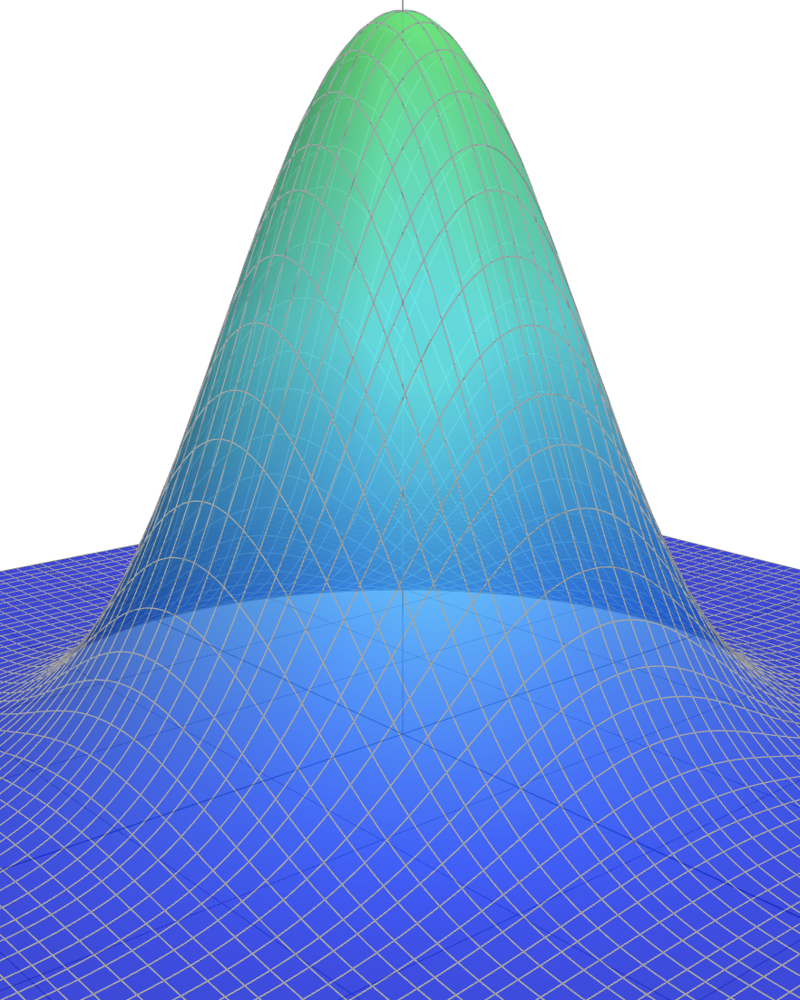
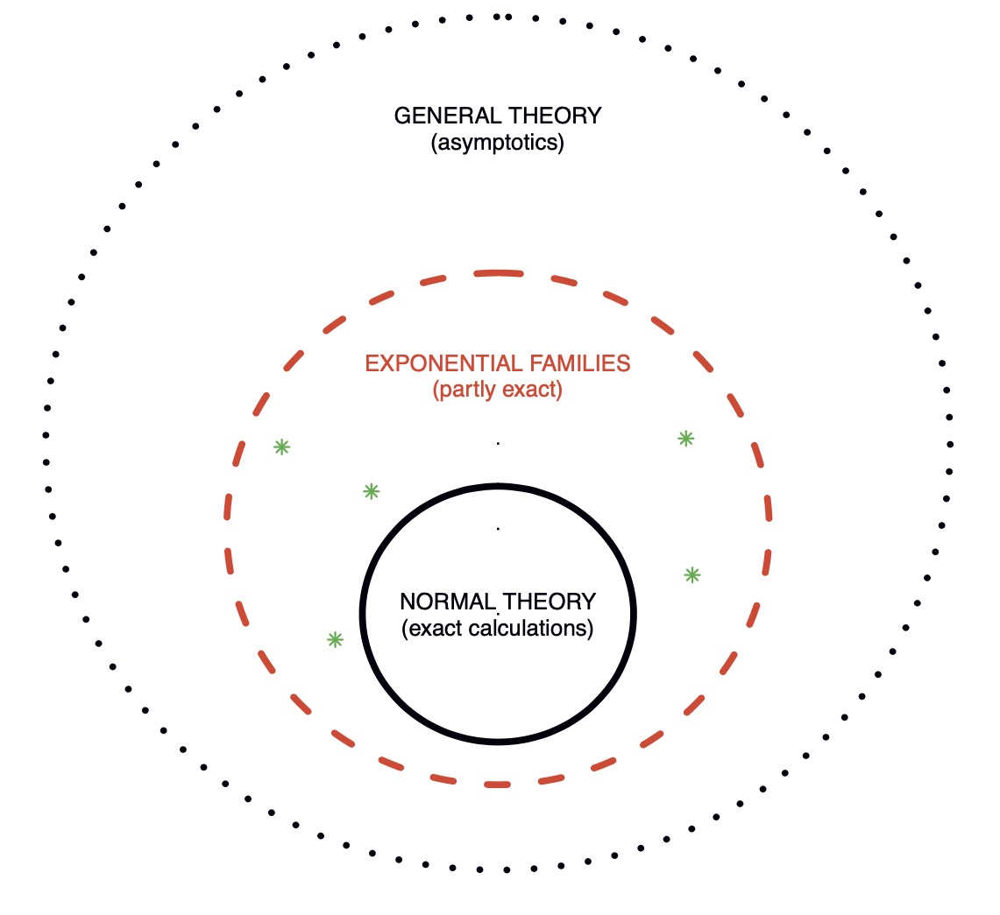
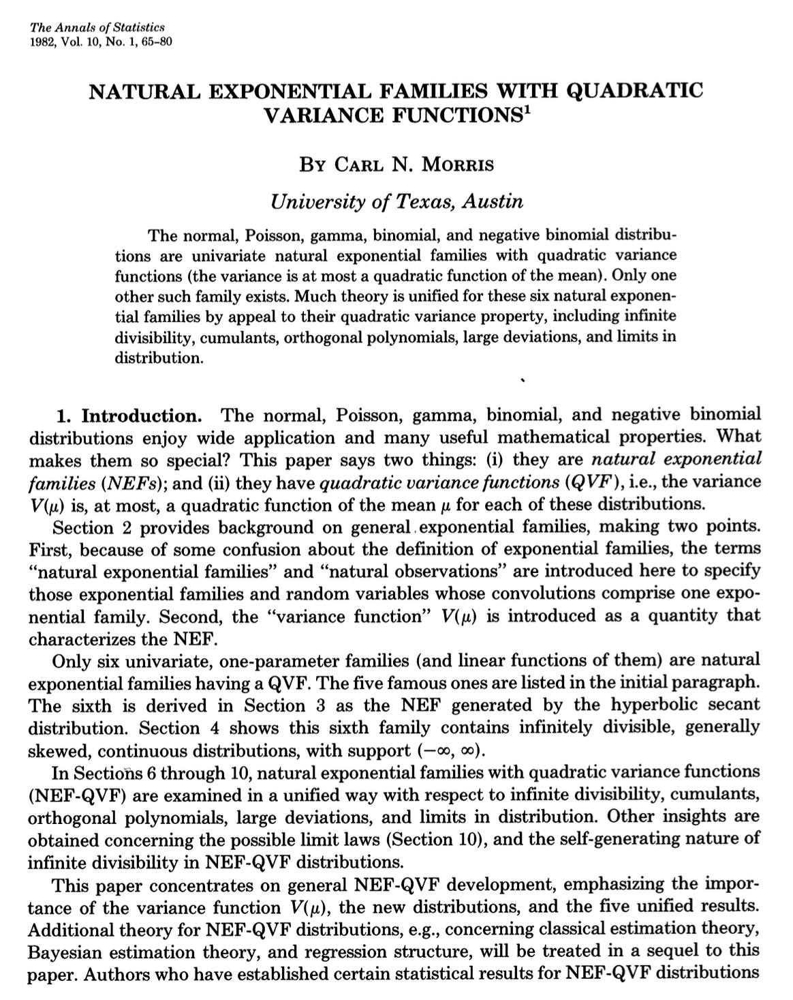
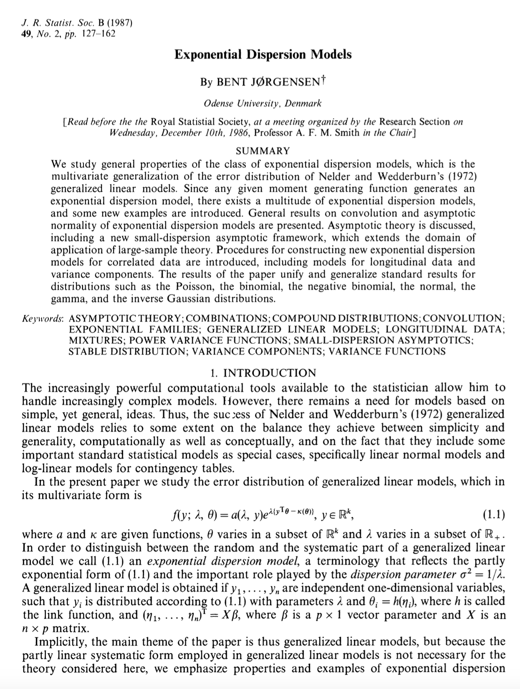
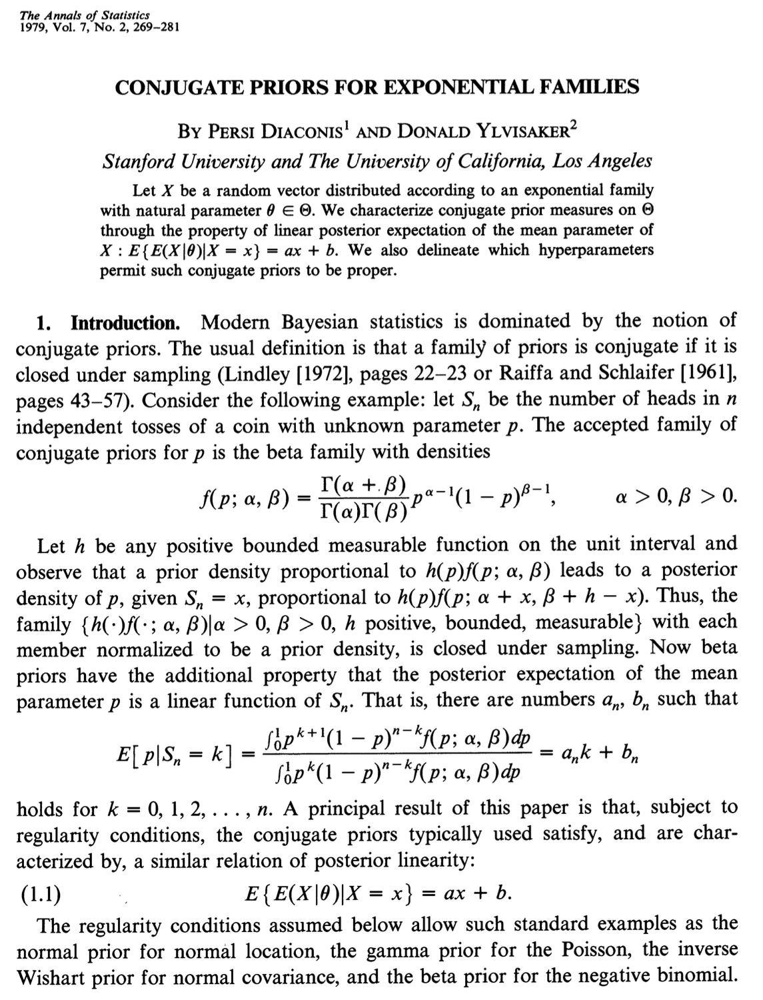
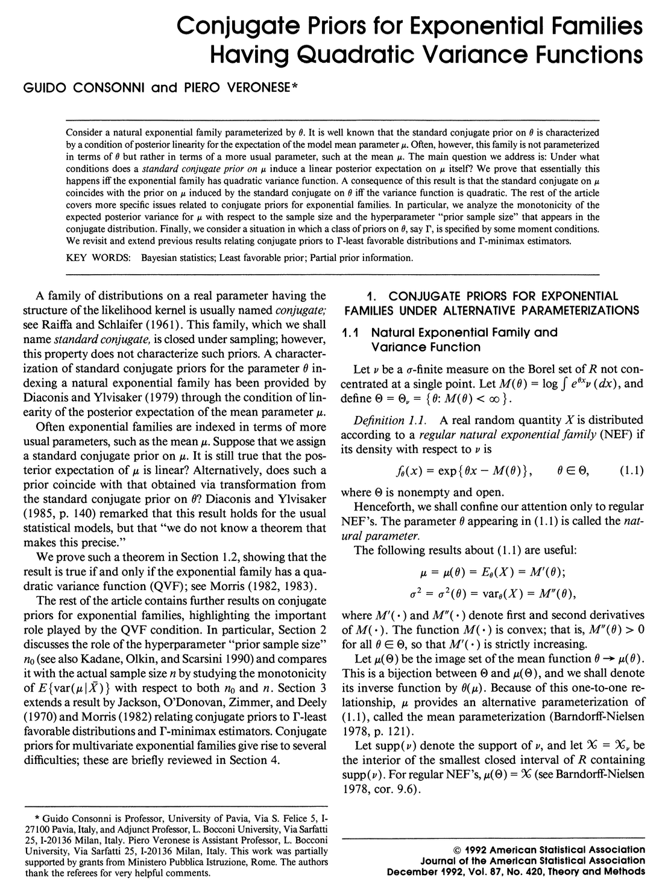

## [Homepage](../index.html)

```{r}
#| warning: false
#| echo: false
#| include: false
#| message: false
#| purl: false

knitr::purl("un_B.qmd", output = "../code/un_B.R", documentation = 0)
styler:::style_file("../code/un_B.R")

library(ggplot2)
library(ggthemes)
```

::: columns
::: {.column width="30%"}


<!-- *"Pluralitas non est ponenda sine necessitate."* -->

<!-- [William of Ockham]{.grey} -->
:::

::: {.column width="70%"}
- This unit will cover the following [topics]{.orange}:
    - One-parameter and multiparameter exponential families
    - Likelihood, inference, sufficiency and completeness
    - Exponential dispersion families
    
- The [prime role]{.orange} of [exponential families]{.orange} in the theory of statistical inference was first emphasized by @Fisher1934.

- Most [well-known]{.blue} [distributions]{.blue}---such as Gaussian, Poisson, Binomial, and Gamma---are instances of exponential families.

- Exponential families are the distributions typically considered when presenting the usual "regularity conditions".

:::

- With a few minor exceptions, this presentation will closely follow Chapters 5 and 6 of @Pace1997.

:::

## Overview

{width=6in fig-align="center"}

- Figure 1 of @Efron2023. Three level of statistical modeling. 

# One-parameter exponential families

## Exponential tilting

- Let $Y$ be a [non-degenerate]{.orange} random variable with [support]{.blue} $\mathcal{Y} \subseteq \mathbb{R}$ and [density]{.orange} $f_0(y)$ with respect to a dominating measure $\nu(\mathrm{d}y)$.

- We aim at building a [parametric family]{.blue} $\mathcal{F} = \{f(;\theta) : \theta \in \Theta \subseteq \mathbb{R} \}$ with common support $\mathcal{Y}$ such that $f_0$ is a special case, namely $f_0 \in \mathcal{F}$.

- A strategy for doing this is called [exponential tilting]{.orange}, namely we could set
$$
f(y; \theta) \propto e^{\theta y}f_0(y).
$$
Thus, if $f(y;\theta)$ is generated via exponential tilting, then $f(y; 0) = e^0 f_0(y) = f_0(y)$. 

- Let us define the mapping $M_0:\mathbb{R}\rightarrow (0,\infty]$
$$
M_0(\theta):=\int_\mathcal{Y}e^{\theta y}f_0(y)\nu(\mathrm{d}y), \qquad \theta \in \mathbb{R}.
$$
If $M_0(\theta)$ is [finite]{.orange} in a neighborhood of the origin, it is the [moment generating function]{.blue} of $Y$. 

- Moreover, we define the set $\tilde{\Theta} \subseteq \mathbb{R}$ as the set of all $\theta$ such that $M_0(\theta)$ is finite, i.e.
$$
\tilde{\Theta} = \{\theta \in \mathbb{R} : M_0(\theta) < \infty\}.
$$

## Natural exponential family of order one

- The mapping $K(\theta) = K_0(\theta) = \log{M_0(\theta)}$ is the [cumulant generating function]{.blue} of $f_0$. It is [finite]{.orange} if and only if $M_0(\theta)$ is finite. 

:::callout-note
The parametric family generated via [exponential tilting]{.orange} of $f_0$
$$
\mathcal{F}_{\text{ne}}^1 = \left\{f(y;\theta) = \frac{e^{\theta y}f_0(y)}{M_0(\theta)} = f_0(y)\exp\{\theta y - K(\theta)\}, \quad y \in \mathcal{Y}, \theta \in \tilde{\Theta} \right\},
$$
is called a [natural exponential family]{.orange} of order one, and $\tilde{\Theta} = \{\theta \in \mathbb{R} : K(\theta) < \infty\}$ is the [natural parameter space]{.blue}. 
:::

-	The natural parameter space $\tilde{\Theta}$ is the [widest possible]{.orange} and must be an [interval]{.orange}; see exercises. The family $\mathcal{F}_{\text{ne}}^1$ is said to be [full]{.blue}, whereas a subfamily of $\mathcal{F}_{\text{ne}}^1$ with $\Theta \subseteq \tilde{\Theta}$ is [non-full]{.blue}.

-	By definition, all the densities $f(y;\theta) \in \mathcal{F}_{\text{ne}}^1$ have the [same support]{.blue}.

:::callout-note
A natural exponential family of order one, $\mathcal{F}_{\text{ne}}^1$, is said to be [regular]{.orange} if $\tilde{\Theta}$ is open.
:::

## Moment generating function

- In regular problems, the functions $M_0(\theta)$ and $K_0(\theta)$ associated to a r.v. $Y$ with density $f_0$ are [finite]{.orange} in a neighbor of the origin. A [sufficient]{.blue} condition is that $\tilde{\Theta}$ is an [open set]{.blue} (regular $\mathcal{F}_\text{en}^1$).

:::callout-warning
Suppose $M_0(t) < \infty$ for any $|t| < t_0$ and for some $t_0 > 0$. Then a standard result of probability theory (e.g. @Billingsley1995, Section 21) implies:
  
- The random variable $Y$ has [finite moments]{.blue} of all orders, i.e. $\mu_k = \mathbb{E}(Y^k) < \infty$ for all $k \geq 1$.
  
- The moments $(\mu_k)_{k \ge 1}$ and  [moment generating function]{.blue} $M_0(t)$ [uniquely characterize]{.orange} the [law]{.orange} of $Y$ and $f_0$. Moreover, $M_0(t)$ admits a [Taylor expansion]{.grey} around the origin:
$$
  M_0(t) = 1 +  \mu_1 t + \mu_2 \frac{t^2}{2!} + \mu_3 \frac{t^3}{3!} + \cdots = \sum_{k=0}^\infty \frac{t^k}{k!}\mu_k, \qquad |t| < t_0.
$$
- The moments $\mu_k$ equal the $k$th derivative of $M_0(t)$ evaluated at the origin:
$$
\mu_k = \mathbb{E}_\theta(Y^k) = \frac{\partial^k}{\partial t^k} M_0(t) \Big|_{t = 0}, \qquad k \ge 1.
$$
:::

## Cumulant generating function

:::callout-warning
Suppose $K_0(t) = \log{M_0(t)} < \infty$ for any $|t| < t_0$ and for some $t_0 > 0$. Then:

- $K_0$ [uniquely characterizes]{.orange} the law of $Y$ and it admits a [Taylor expansion]{.grey}
$$
K_0(t) = \kappa_1 t + \kappa_2 \frac{t^2}{2!} + \kappa_3 \frac{t^3}{3!} + \cdots = \sum_{k=1}^\infty \frac{t^k}{k!} \kappa_k, \qquad |t| < t_0,
$$
where the coefficients $(\kappa_k)_{k \ge 1}$ are the [cumulants]{.blue} of $Y$.

- The cumulants $\kappa_k$ equal the $k$th derivative of $K_0(t)$ evaluated at the origin
$$
\kappa_k = \frac{\partial^k}{\partial t^k} K_0(t) \Big|_{t = 0}, \qquad k \ge 1.
$$
Moreover, it can be shown the following moment relationships hold:
$$
\kappa_1 = \mathbb{E}_\theta(Y), \quad \kappa_2 = \text{var}_\theta(Y), \quad \kappa_3 = \mathbb{E}_\theta\{(Y - \mu_1)^3\}, \quad \kappa_4 = \mathbb{E}_\theta\{(Y - \mu_1)^4\} - 3\text{var}_\theta(Y)^2. 
$$
:::

::: aside
Refer to @Pace1997, Section 3.2.5 for detailed derivations. Standardized cumulants $\kappa_3/\kappa_2^{3/2}$ and $\kappa_4/\kappa_2^2$ are the [skewness]{.blue} and the (excess of) [kurtosis]{.blue} of $Y$.
:::

## Example: uniform distribution 📖 

- Let $Y \sim \text{Unif}(0,1)$ so that $f_0(y) = 1$ for $y \in [0,1]$. The [exponential tilting]{.orange} of $f_0$ gives
$$
f(y; \theta) \propto e^{\theta y}f_0(y) = e^{\theta y}, \qquad y \in [0,1], \quad \theta \in \mathbb{R}.
$$
- The normalizing constant, that is, the [moment generating function]{.blue}, is
$$
M_0(\theta)= \mathbb{E}(e^{\theta Y})  = \int_0^1 e^{\theta y} \mathrm{d}y = \frac{e^\theta}{\theta}\Big|_0^1 = \frac{e^\theta - 1}{\theta}, \qquad \theta \neq 0.
$$
with $M_0(0) = 1$. Note that $M_0$ is continuous since $\lim_{\theta \to 0}(e^\theta - 1)/\theta = 1$.

- Consequently, we have $M_0(\theta) < \infty$ for all $\theta \in \mathbb{R}$ and the [natural parameter space]{.orange} is $\tilde{\Theta} = \mathbb{R}$, which is an [open set]{.blue}. The resulting density is
$$
f(y; \theta) = \frac{\theta e^{\theta y}}{e^{\theta -1}} = \exp\{\theta y - K(\theta)\}, \qquad y \in [0, 1],
$$
where $K(\theta) = \log\{(e^\theta - 1)/\theta\}$.

- It [holds in general](https://math.stackexchange.com/questions/1008707/moment-generating-function-of-bounded-variables) that $\tilde{\Theta} = \mathbb{R}$ whenever $f_0$ has [bounded support]{.blue}; thus, the family is [regular]{.orange}.

## Example: Poisson distribution 📖 

- Let $Y \sim \text{Poisson}(1)$ so that $f_0(y) = e^{-1}/y!$ for $y \in \mathbb{N}$. The [exponential tilting]{.orange} of $f_0$ gives
$$
f(y; \theta) \propto e^{\theta y}f_0(y) = \frac{e^{\theta y}e^{-1}}{y!}, \qquad y \in \mathbb{N}, \quad \theta \in \mathbb{R}.
$$
- The normalizing constant, that is, the [moment generating function]{.blue}, is
$$
M_0(\theta)= \mathbb{E}(e^{\theta Y})  = e^{-1}\sum_{k=0}^\infty \frac{e^{\theta y}}{y!} = \exp\{e^\theta - 1\}, \qquad \theta \in \mathbb{R}.
$$
- Consequently, we have $M_0(\theta) < \infty$ for all $\theta \in \mathbb{R}$ and the [natural parameter space]{.orange} is $\tilde{\Theta} = \mathbb{R}$, which is an [open set]{.blue}. The resulting density is
$$
f(y; \theta) = \frac{e^{\theta y} e^{-1}}{y!}\frac{e^{-e^\theta}}{e^{-1}} = \frac{e^{-1}}{y!}\exp\{\theta y - (e^\theta - 1)\} = \frac{\lambda^y e^{\lambda}}{y!}, \qquad y \in \mathbb{N},
$$
so that $K(\theta) = e^\theta - 1$ and having defined $\lambda  = e^\theta$. 

- In other words, the tilted density is again a Poisson distribution with mean $e^\theta$. 

## Example: exponential family generated by a Gaussian 📖 

- Let $Y \sim \text{N}(0,1)$ so that $f_0(y) = 1/(\sqrt{2\pi})e^{-y^2/2}$ for $y \in \mathbb{R}$. The [exponential tilting]{.orange} of $f_0$ gives
$$
f(y; \theta) \propto e^{\theta y}f_0(y) = \frac{1}{\sqrt{2\pi}}e^{\theta y -y^2/2}, \qquad y,\theta \in \mathbb{R}.
$$
- The normalizing constant, that is, the [moment generating function]{.blue}, is
$$
M_0(\theta)= \mathbb{E}(e^{\theta Y})  = \frac{1}{\sqrt{2\pi}}\int_\mathbb{R}e^{\theta y -y^2/2}\mathrm{d}y = e^{\theta^2/2}, \qquad \theta \in \mathbb{R}.
$$
- Consequently, we have $M_0(\theta) < \infty$ for all $\theta \in \mathbb{R}$ and the [natural parameter space]{.orange} is $\tilde{\Theta} = \mathbb{R}$, which is an [open set]{.blue}. The resulting density is
$$
f(y; \theta) = \frac{1}{\sqrt{2\pi}}e^{\theta y}e^{-y^2/2}e^{-\theta^2/2} = \frac{e^{-y^2/2}}{\sqrt{2\pi}}\exp\{\theta y - \theta^2/2\} = \frac{1}{\sqrt{2\pi}}e^{-\frac{1}{2}(y - \theta)^2}, \qquad y \in \mathbb{R},
$$
so that $K(\theta) = \theta^2/2$. 

- In other words, the tilted density is again a Gaussian distribution with mean $\theta$. 


## Closure under exponential tilting 📖 

- Let $\mathcal{F}_{\text{ne}}^1$ be an exponential family with [parameter]{.blue} $\psi$ and [natural parameter space]{.orange} $\tilde{\Psi}$, with density $f(y; \psi) = f_0(y)\exp\{\psi y - K(\psi)\}$. The [exponential tilting]{.orange} of $f(y; \psi)$ gives
$$
f(y; \theta, \psi) \propto e^{\theta y} f(y; \psi) \propto f_0(y) \exp\{(\theta + \psi)y\},
$$
and the [normalizing constant]{.blue} of $f_0(y) \exp\{(\theta + \psi)y\}$ is therefore  
$$
\int_\mathcal{Y} f_0(y) \exp\{(\theta + \psi)y\} \, \nu(\mathrm{d}y) = M_0(\theta + \psi).
$$

- Thus, for any $\theta$ and $\psi$ such that $M_0(\theta + \psi) < \infty$, the corresponding density is
$$
f(y; \theta, \psi) = f_0(y) \exp\{(\theta + \psi)y - K(\theta + \psi)\},
$$
which is again a [member]{.blue} of the [exponential family]{.orange} $\mathcal{F}_{\text{ne}}^1$, with updated parameter $\theta + \psi$.

:::callout-tip
Exponential families are [closed]{.blue} under [exponential tilting]{.orange}, and $\mathcal{F}_{\text{ne}}^1$ can be thought of as being generated by any of its members.
:::

## Moments and cumulants

- The functions $M_0(\theta)$ and $K(\theta) = K_0(\theta)$ of a $\mathcal{F}_\text{en}^1$, refer to the [baseline]{.orange} density $f_0(y)$. Indeed, for any fixed $\theta$, the [moment generating function]{.blue} of $f(y; \theta) \in \mathcal{F}_\text{en}^1$ is
$$
M_\theta(t) := \int_\mathcal{Y} e^{ty} f(y; \theta)\, \nu(\mathrm{d}y) 
  = \frac{1}{M_0(\theta)} \int_\mathcal{Y} e^{(t + \theta)y} f_0(y)\, \nu(\mathrm{d}y) 
  = \frac{M_0(t + \theta)}{M_0(\theta)}, \quad t + \theta \in \tilde{\Theta}.
$$

- Consequently, the [cumulant generating function]{.orange} of $f(y; \theta)$ relates to $K_0$ as follows:
$$
K_\theta(t) = \log M_\theta(t) = K_0(t + \theta) - K_0(\theta), \quad t + \theta \in \tilde{\Theta}.
$$

:::aside
Textbooks sometimes suppress additive constants in defining  $K_0(\theta)$, e.g. using $e^\theta$ instead of $e^\theta-1$. This is inconsequential (constants cancel in $K_\theta(t)$) but somewhat misleading.
:::

:::callout-tip
If $\mathcal{F}_\text{en}^1$ is a [regular]{.orange} family, then $\tilde{\Theta}$ is an [open set]{.blue}, and $\tilde{\Theta} = \text{int}\:\tilde{\Theta}$, meaning that $\theta$ is always an [inner point]{.blue} of $\tilde{\Theta}$. Therefore, there exists a $t_0$ such that $t + \theta \in \tilde{\Theta}$ for all $|t| < t_0$ implying that both $M_\theta$ and $K_\theta$ are [well-defined]{.orange}.


If $\mathcal{F}_\text{en}^1$ is [not]{.orange} regular, then for $M_\theta(t)$ and $K_\theta(t)$ to be well-defined, we require that $\theta$ is [not]{.orange} a [boundary point]{.blue}; that is, $\theta \in \text{int}\:\tilde{\Theta}$, meaning it belongs to the interior of $\tilde{\Theta}$.
:::


## Mean value mapping I

- [Moments]{.blue} and [cumulants]{.orange} exist for every $\theta \in \text{int}\:\tilde{\Theta}$. In particular, the cumulants are
$$
\kappa_k = \frac{\partial^k}{\partial t^k} K_\theta(t) \Big|_{t = 0} = \frac{\partial^k}{\partial t^k} \left[ K(t + \theta) - K(\theta) \right] \Big|_{t = 0} = \frac{\partial^k}{\partial \theta^k} K(\theta), \qquad k \ge 1.
$$

:::callout-note
Let $Y \sim f(y; \theta)$, with $f(y; \theta) \in \mathcal{F}_\text{en}^1$. The first two moments of $Y$ are obtained as: 
$$
\mu(\theta) := \mathbb{E}_\theta(Y) = \frac{\partial}{\partial \theta} K(\theta), \qquad \text{var}_\theta(Y) = \frac{\partial}{\partial \theta} \mu(\theta) = \frac{\partial^2}{\partial \theta^2} K(\theta),
$$
We call $\mu : \text{int}\:\tilde{\Theta} \to \mathbb{R}$ the [mean value mapping]{.orange}. 
:::

- If $f_0$ is non-degenerate, then $\text{var}_\theta(Y) > 0$, implying that $K(\theta)$ is a [convex function]{.blue}, and $\mu(\theta)$ is a [smooth]{.orange} and [monotone increasing]{.orange}, namely is a [one-to-one]{.blue} map. 

- Thus, if $\mathcal{F}_\text{en}^1$ is a [regular]{.orange} exponential family, then $\tilde{\Theta} = \text{int}\:\tilde{\Theta}$ and $\mu(\theta)$ is a [reparametrization]{.blue}. 

## Mean value mapping II

:::callout-note
The mean value mapping has range $\mathcal{M} = \text{Range}(\mu) = \{\mu(\theta) : \theta \in \text{int}\:\tilde{\Theta}\}$. The set $\mathcal{M} \subseteq\mathbb{R}$ is called [mean space]{.blue} or [expectation space]{.orange}. 
:::

:::callout-note
Let $C = C(\mathcal{Y})$ be the [closed convex hull]{.blue} of the sample space $\mathcal{Y}$, which is the [smallest closed convex set]{.blue} $C \subseteq \mathbb{R}$ [containing]{.orange} $\mathcal{Y}$, namely:
$$
C(\mathcal{Y}) = \{ y \in \mathbb{R} : y = \lambda y_1 + (1 - \lambda)y_2, \quad 0 \le \lambda \le 1, \quad y_1,y_2 \in \mathcal{Y}\}.
$$
:::

- Hence, if $\mathcal{Y} = \{0, 1, \dots, N\}$, then $C = [0,N]$. If $\mathcal{Y} = \mathbb{N}$, then $C = \mathbb{R}^+$. If $\mathcal{Y} = \mathbb{R}$, then $C = \mathbb{R}$.

- Because of the properties of expectations, $\mu(\theta) \in \text{int}\:C(\mathcal{Y})$ for all $\theta \in \text{int}\:\tilde{\Theta}$, namely
$$
\mathcal{M} \subseteq \text{int}\:C(\mathcal{Y}).
$$
Indeed, $\text{int}\:C(\mathcal{Y})$ is an [open interval]{.orange} whose extremes are the [infimum]{.blue} and [supremum]{.blue} of $\mathcal{Y}$.

:::aside
Both definitions naturally generalize to the multivariate case when $C, \mathcal{Y} \subseteq \mathbb{R}^p$, for $p > 1$. 
:::

## Mean value mapping III 📖 

- In a regular exponential family, the mean value mapping $\mu(\theta)$ is a [reparametrization]{.orange}, meaning that for each $\theta \in \tilde{\Theta}$, there exists a [unique]{.blue} mean $\mu \in \mathcal{M}$ such that $\mu = \mu(\theta)$.

- Moreover, in regular families, a much stronger result holds: for each value of $y \in \text{int}\:C(\mathcal{Y})$, there exists a [unique]{.orange} $\theta \in \tilde{\Theta}$ such that $\mu(\theta) = y$.

:::callout-warning
#### Theorem (@Pace1997, Theorem 5.1)

If $\mathcal{F}_\text{en}^1$ is regular, then $\Theta = \text{int}\:\tilde{\Theta}$ and $\mathcal{M} = \text{int}\:C.$
:::

- This establishes a [duality]{.blue} between the expectation space $\mathcal{M}$ and the sample space. Any value in $\text{int}\:C$ can be "reached", that is, there exists a distribution $f(y; \theta)$ with that mean.

- This correspondence is crucial in maximum likelihood estimation and inference.

:::aside
This theorem can actually be strengthened: a necessary and sufficient condition for $\mathcal{M} = \text{int}\:C$ is that the family $\mathcal{F}_\text{en}^1$ is [steep]{.orange} (a regular family is also steep); see @Pace1997.
:::

## A non regular and non steep exponential family

- Let us a consider an exponential family $\mathcal{F}_\text{en}^1$ generated by the density
$$
f_0(y) = c \frac{e^{-|y|}}{1 + y^4}, \qquad y \in \mathbb{R}.
$$
for some normalizing constant $c > 0$. The [exponential tilting]{.orange} of $f_0$ gives
$$
f(y; \theta) \propto e^{\theta y}f_0(y) \propto \frac{e^{-|y| + \theta y}}{1 + y^4}, \qquad y \in \mathbb{R}, \quad \theta \in \tilde{\Theta}.
$$
- The function $M_0(\theta)$ is unavailable in closed form, however $\tilde{\Theta} = [-1,1]$ since
$$
M_0(\theta) < \infty, \qquad \theta \in  [-1, 1]. 
$$
- Since $\tilde{\Theta}$ is a [closed set]{.blue}, the exponential family is [not regular]{.orange} (and is not steep either). In fact, one can show that $\lim_{\theta \to 1} \mu(\theta) = a < \infty$, implying that
$$
\mathcal{M} = (-a, a), \qquad \text{ whereas } \qquad \text{int}\:C = \mathbb{R}.
$$
- In other words, there are no values of $\theta$ such that $\mu(\theta) = y$ for any $y > a$, which implies, for instance, that the method of moments will encounter difficulties in estimating $\theta$.


## Variance function I 📖 

:::callout-note
Let $Y \sim f(y; \theta)$, with $f(y; \theta) \in \mathcal{F}_\text{en}^1$ and let $\theta(\mu)$ be the [inverse map]{.orange} of $\mu(\theta)$. The variance of $Y$ can be expressed as a function of $\mu$:
$$
V(\mu) := \text{var}_{\theta(\mu)}(Y) = \frac{\partial^2}{\partial \theta^2} K(\theta) \Big|_{\theta = \theta(\mu)}.
$$
The function $V : \mathcal{M} \to \mathbb{R}^+$ is called the [variance function]{.orange} of the exponential family $\mathcal{F}_\text{en}^1$.
:::

- The importance of the variance function $V(\mu)$ is related to the following [characterization]{.blue} result due to @Morris1982.

:::callout-warning
#### Theorem (@Pace1997, Theorem 5.2)
If $Y$ has a density that belongs to a $\mathcal{F}_\text{en}^1$, then the [pair]{.orange} $(\mathcal{M}, V(\mu))$ [uniquely]{.blue} determine the natural parameter space $\tilde{\Theta}$ and the cumulant generating function $K(\theta)$, and hence also $f(y;\theta)$.
:::


## Variance function II 📖 

- The characterization theorem of @Morris1982 is [constructive]{.blue} in nature, as its [proof]{.orange} provides a practical way of determining $K(\theta)$ from $(\mathcal{M}, V(\mu))$. In particular, the function $K(\cdot)$ must satisfy
$$
K\left(\int_{\mu_0}^\mu \frac{1}{V(m)}\mathrm{d}m\right) = \int_{\mu_0}^\mu \frac{m}{V(m)}\mathrm{d}m,
$$
where $\mu_0$ is an arbitrary point in $\mathcal{M}$.

- For example, let $\mathcal{M} = (0, \infty)$ and $V(\mu) = \mu^2$. Then, choosing $\mu_0=1$ gives
$$
K\left(1 - \frac{1}{\mu}\right) = \log\mu,
$$
and therefore $\theta(\mu) = 1 - 1/\mu$, giving $\tilde{\Theta} = (-\infty, 1)$ and $\mu(\theta) = (1 - \theta)^{-1}$. Hence we obtain $K(\theta) = -\log(1 - \theta)$, which corresponds to the exponential density $f_0(y) = e^{-y}$, for $y > 0$.

:::callout-tip
In order to identify $\mathcal{F}_\text{en}^1$ [both]{.orange} $\mathcal{M}$ and $V(\mu)$ must be known.
:::

## Well-known exponential families

| Notation | $\text{N}(\psi, 1)$ | $\text{Poisson}(\psi)$ | $\text{Bin}(N, \psi)$ | $\text{Gamma}(\nu,\psi), \nu > 0$|
|:-------------------------------|-------------|-----------|---------------------------------------------|----------------------------------|
| $\mathcal{Y}$ | $\mathbb{R}$ | $\mathbb{N}$ | $\{0, 1, \dots, N\}$ | $(0, \infty)$ |
| [Natural param.]{.orange}
| $\theta(\psi)$ | $\psi$ | $\log{\psi}$ | $\log\{\psi/(1 - \psi)\}$ | $-\psi$ |
| $f_0(y)$ | $(\sqrt{2\pi})^{-1}e^{-\frac{1}{2}y^2}$ | $e^{-1}/ y!$ | $\binom{N}{y}\left(\frac{1}{2}\right)^N$ | $y^{\nu - 1}e^{-y}/\Gamma(\nu)$ |
| $K(\theta)$ | $\theta^2/2$ | $e^\theta-1$ | $N \log(1 + e^\theta) - N\log{2}$ | $-\nu \log(1-\theta)$ |
| $\tilde{\Theta}$ | $\mathbb{R}$ | $\mathbb{R}$ | $\mathbb{R}$ | $(-\infty, 0)$ |
| [Mean param.]{.blue} |
| $\mu(\theta)$ | $\theta$ | $e^\theta$ | $N e^\theta/(1 + e^{\theta})$ | $-\nu/\theta$ |
| $\mathcal{M}$ | $\mathbb{R}$ | $(0, \infty)$ | $(0, N)$ | $(0, \infty)$ |
| $V(\mu)$ | $1$ | $\mu$ | $\mu(1 - \mu/ N)$ | $\mu^2/\nu$ |

## Quadratic variance functions

- There is more in @Morris1982's paper. Specifically, he focused on a subclass of [quadratic]{.orange} variance functions, which can be written as
$$
V(\mu) = a + b\mu + c\mu^2,
$$
for some known constants $a$, $b$, and $c$.

- @Morris1982 showed that, up to transformations such as convolution, there exist only [six families]{.blue} within $\mathcal{F}_\text{en}^1$ that possess a [quadratic variance]{.orange} function. These are: (i) the normal, (ii) the Poisson, (iii) the gamma, (iv) the binomial, (v) the negative binomial, and (vi) a sixth family.

- The sixth (less known) distribution is called the [generalized hyperbolic secant]{.blue}, and it has density
$$
f(y; \theta) = \frac{\exp\left\{\theta y - \log\cos{\theta}\right\}}{2\cosh(\pi y/2)}, \qquad y \in \mathbb{R}, \quad \theta \in (-\pi/2, \pi/2),
$$
with [mean]{.orange} function $\mu(\theta) = \tan{\theta}$ and [variance]{.blue} function $V(\mu) = \csc^2(\theta) = 1 + \mu^2$, and $\mathcal{M} = \mathbb{R}$. It is also a [regular]{.orange} exponential family.


## A general definition of exponential families I

:::callout-note
Let $h(y) > 0$, $s(y)$, be real-valued functions not depending on $\psi$ and let $\theta(\psi), G(\psi)$ be real-valued functions not depending on $y$. The parametric family
$$
\mathcal{F}_{\text{e}}^1 = \left\{f(y;\psi) = h(y)\exp\{\theta(\psi) s(y) - G(\psi)\}, \quad y \in \mathcal{Y}\subseteq \mathbb{R}, \: \psi \in \Psi \right\},
$$
is called a [exponential family]{.orange} of order one, where the normalizing constant is
$$
G(\psi) = \int_\mathcal{Y} h(y) \exp\{\theta(\psi) s(y)\} \nu(\mathrm{d}y).
$$
The family is [full]{.blue} if the parameter space $\Psi$ is the widest possible $\tilde{\Psi} = \{\psi \subseteq\mathbb{R}: G(\psi) < \infty\}$. 
:::

:::callout-tip
Suppose $f(y; \psi) \in \mathcal{F}_\text{e}^1$. Then, the function $\theta(\psi)$ must be a [one-to-one]{.blue} mapping, that is, a [reparametrization]{.orange}, otherwise, the model would [not]{.orange} be [identifiable]{.orange}. Hence, we can write:
$$
f(y; \psi) = h(y)\exp\{\theta(\psi) s(y) - K(\theta(\psi))\},
$$
for some function $K(\cdot)$ such that $G(\psi) = K(\theta(\psi))$. 
:::

## A general definition of exponential families II

- When $s(y)$ is an arbitrary function of $y$, then $\mathcal{F}_\text{e}^1$ is [broader]{.blue} than $\mathcal{F}_\text{en}^1$. 

- Without loss of generality, we can focus on the natural parametrization $\theta \in \Theta$, meaning that $f(y;\theta) \in \mathcal{F}_\text{e}^1$ can be written as
$$
f(y; \theta) = h(y)\exp\{\theta s(y) - K(\theta)\},
$$
because the general case would be a [reparametrization]{.orange} of this one.

- Let $Y \sim f(y; \theta)$, with $f(y; \theta) \in \mathcal{F}_\text{e}^1$. Then, the random variable $S = s(Y)$ has density
$$
f_S(s; \psi) = f_0(s)\exp\{\theta s - K(\theta)\},
$$
for some baseline density $f_0(s)$, namely $f_S(s; \psi) \in \mathcal{F}_\text{en}^1$. If in addition $s(y)$ is a [one-to-one]{.orange} invertible mapping, this means $Y = s^{-1}(S)$ is just a transformation of a $\mathcal{F}_\text{en}^1$.

:::callout-tip
A full exponential family $\mathcal{F}_\text{e}^1$ is, technically, a broader definition, but in practice it leads to a [reparametrization]{.orange} of a natural exponential family $\mathcal{F}_\text{en}^1$ in a [transformed space]{.blue} $s(Y)$. 
:::

## Independent sampling

- Let $Y_1,\dots,Y_n$ be iid random variables with density $f(y; \theta)$, where $f(y; \theta) \in \mathcal{F}_\text{e}^1$ is a full exponential family. Without loss of generality, assume the density can be written as
$$
f(y; \theta) = h(y)\exp\{\theta s(y) - G(\theta)\}, \qquad \theta \in \tilde{\Theta}.
$$

- The [likelihood]{.blue} function is
$$
L(\theta; \bm{y}) = \prod_{i=1}^n \exp\left\{\theta s(y_i) - G(\theta)\right\} = \exp\left\{\theta \sum_{i=1}^n s(y_i) - n G(\theta)\right\},
$$
from which we see that $s = \sum_{i=1}^n s(y_i)$ is the [minimal sufficient statistic]{.orange} for $\theta$.

- Inference can therefore be based on the random variable $S = \sum_{i=1}^n s(Y_i)$, whose distribution is
$$
f_S(s; \theta) = f_0(s)\exp\{\theta s - K(\theta)\},
$$
with $K(\theta) = n G(\theta)$ and for some density $f_0(s)$. That is, the distribution of the minimal sufficient statistic $f_S(s; \theta)$ is itself a [natural exponential family]{.blue} of order one.

# Multiparameter exponential families

## Natural exponential families of order $p$

- Let $Y$ be a [non-degenerate]{.orange} random variable with [support]{.blue} $\mathcal{Y} \subseteq \mathbb{R}^p$ and [density]{.orange} $f_0(y)$ with respect to a dominating measure $\nu(\mathrm{d}y)$.

- Let us define the mapping $M_0:\mathbb{R}^p\rightarrow (0,\infty]$
$$
M_0(\theta):=\int_\mathcal{Y}e^{\theta^T y}f_0(y)\nu(\mathrm{d}y), \qquad \theta \in \mathbb{R}^p.
$$

:::callout-note
The parametric family generated via [exponential tilting]{.orange} of a density $f_0$ 
$$
\mathcal{F}_{\text{ne}}^p = \left\{f(y;\theta) = \frac{e^{\theta^T y}f_0(y)}{M_0(\theta)} = f_0(y)\exp\{\theta^T y - K(\theta)\}, \quad y \in \mathcal{Y}\subseteq \mathbb{R}^p, \:\theta \in \tilde{\Theta} \right\},
$$
is called a [natural exponential family]{.orange} of order one, $K(\theta) = \log M_0(\theta)$ and $\tilde{\Theta} = \{\theta \in \mathbb{R}^p : K(\theta) < \infty\}$ is the [natural parameter space]{.blue}. 
:::

- The family $\mathcal{F}_{\text{ne}}^p$ is said to be [full]{.blue}, whereas a subfamily of $\mathcal{F}_{\text{ne}}^p$ with $\Theta \subseteq \tilde{\Theta}$ is [non-full]{.blue}. Moreover, the family $\mathcal{F}_{\text{ne}}^p$ is said to be [regular]{.orange} if $\tilde{\Theta}$ is an open set. 

## Example: multinomial distribution I 📖

- Let $Y = (Y_1,\dots,Y_{p-1}) \sim \text{Multinom}(N; 1/p,\dots,1/p)$ be a [multinomial]{.orange} random vector with [uniform probabilities]{.blue}, so that its density $f_0$ is  
$$
f_0(y) = \frac{N!}{y_1!\cdots y_p!}\left(\frac{1}{p}\right)^N, \qquad y = (y_1,\dots,y_{p-1}) \in \mathcal{Y} \subseteq \mathbb{R}^{p-1},
$$
where $\mathcal{Y} = \{(y_1,\dots,y_{p-1}) \in \{0,\dots,N\}^{p-1} : \sum_{j=1}^{p-1} y_j \le N\}$, having set $y_p := N - \sum_{j=1}^{p-1} y_j$.

- The [exponential tilting]{.orange} of $f_0$ yields
$$
f(y; \theta) \propto f_0(y) e^{\theta^T y} = \frac{N!}{y_1!\cdots y_p!}\left(\frac{1}{p}\right)^N e^{\theta_1 y_1 + \cdots + \theta_{p-1} y_{p-1}}, \qquad y \in \mathcal{Y}, \;\theta \in \mathbb{R}^{p-1}.
$$

- As a consequence of the [multinomial theorem]{.orange}, the normalizing constant, that is, the [moment generating function]{.blue}, is  
$$
M_0(\theta) = \mathbb{E}\left(e^{\theta^T Y}\right) = \left(\frac{1}{p}\right)^N(1 + e^{\theta_1} + \cdots + e^{\theta_{p-1}})^N.
$$
  Thus $M_0(\theta) < \infty$ for all $\theta \in \mathbb{R}^{p-1}$ and the [natural parameter space]{.orange} is the [open set]{.blue} $\tilde{\Theta} = \mathbb{R}^{p-1}$.


## Example: multinomial distribution II 📖

- The resulting [tilted]{.orange} density is
$$
f(y; \theta) = f_0(y)e^{\theta^Ty - K(\theta)} = \frac{N!}{y_1!\cdots y_p!}\frac{e^{\theta_1 y_1 + \cdots + \theta_{p-1}y_{p-1}}}{(1 + e^{\theta_1} + \cdots + e^{\theta_{p-1}})^N}, 
$$
where $K(\theta) = \log{M_0(\theta)} = N\log(1 + e^{\theta_1} + \cdots + e^{\theta_{p-1}}) - N\log{p}$.

- In other words, the tilted density is again a [multinomial]{.blue} distribution with parameters $N$ and [probabilities]{.orange} $\pi_j = e^{\theta_j} / (1 + e^{\theta_1} + \cdots + e^{\theta_{p-1}})$. In fact, we can write:
$$
\begin{aligned}
f(y; \theta) &= \frac{N!}{y_1!\cdots y_p!}\frac{e^{\theta_1 y_1}  \cdots  e^{\theta_p y_p}}{(\sum_{j=1}^p e^{\theta_j})^{y_1} \cdots (\sum_{j=1}^p e^{\theta_j})^{y_p}} = \frac{N!}{y_1!\cdots y_p!} \prod_{j=1}^p\left(\frac{e^{\theta_j}}{\sum_{k=1}^p e^{\theta_k}}\right)^{y_j} \\
&= \frac{N!}{y_1!\cdots y_p!} \prod_{j=1}^p\pi_j^{y_j}.
\end{aligned}
$$
where we defined $\theta_p := 0$, so that $\sum_{j=1}^pe^{\theta_j} = 1 + e^{\theta_1} + \cdots + e^{\theta_{p-1}}$, recalling that $\sum_{j=1}^py_j = N$.

- The tilted density belongs to a regular [natural exponential family]{.blue} $\mathcal{F}_\text{en}^{p-1}$ of [order]{.orange} $p-1$. 


## Mean value mapping and other properties

<!-- - Properties of moments and cumulants in the one-parameter case carry over to the multi-parameter setting, with the obvious adjustments. -->

- Let $Y \sim f(y; \theta)$, with $f(y; \theta) \in \mathcal{F}_\text{en}^p$. The cumulant generating function is  
$$
K_\theta(t) = \log M_\theta(t) = K_0(t + \theta) - K_0(\theta), \qquad t + \theta \in \tilde{\Theta}.
$$
In particular, the first two moments of $Y$ are obtained as:  
$$
\mu(\theta) := \mathbb{E}_\theta(Y) = \frac{\partial}{\partial \theta} K(\theta), \qquad \text{var}_\theta(Y) = \frac{\partial}{\partial \theta^\top} \mu(\theta) = \frac{\partial^2}{\partial \theta \partial \theta^\top} K(\theta),
$$

- If $f_0$ is non-degenerate, then the [covariance matrix]{.blue} $\text{var}_\theta(Y)$ is [positive definite]{.orange}, implying that $K(\theta)$ is a [convex function]{.blue}, and $\mu(\theta)$ is a [smooth]{.orange} [one-to-one]{.blue} map.

- The definitions of mean value mapping $\mu(\theta)$, its range $\mathcal{M}$, the convex hull $C(\mathcal{Y})$ of the sample space, and the variance function $V(\mu)$ also naturally extend to the multi-parameter setting.

- Refer to @Jorgensen1987 for an extension of the results of @Morris1982 about $V(\mu)$.

:::callout-warning
#### Theorem (@Pace1997, Theorem 5.3)
If $\mathcal{F}_\text{en}^p$ is regular, then  $\mathcal{M} = \text{int}\:C.$
:::


## A general definition of exponential families I

:::callout-note
Let $h(y) > 0$, $s_1(y),\dots,s_p(y)$, be real-valued functions not depending on $\psi$ and let $\theta(\psi), G(\psi)$ be real-valued functions not depending on $y$. The parametric family
$$
\mathcal{F}_{\text{e}}^p = \left\{f(y;\psi) = h(y)\exp\{\theta(\psi) s(y) - G(\psi)\}, \quad y \in \mathcal{Y}\subseteq \mathbb{R}, \: \psi \in \Psi \right\},
$$
is called a [exponential family]{.orange} of order one, where the normalizing constant is
$$
G(\psi) = \int_\mathcal{Y} h(y) \exp\{\theta(\psi) s(y)\} \nu(\mathrm{d}y).
$$
The family is [full]{.blue} if the parameter space $\Psi$ is the widest possible $\tilde{\Psi} = \{\psi \subseteq\mathbb{R}: G(\psi) < \infty\}$. 
:::

## A general definition of exponential families II

:::callout-tip
Suppose $f(y; \psi) \in \mathcal{F}_\text{e}^1$ and [$s(y) = y$]{.blue}, so that   $f(y; \psi) = h(y)\exp\{\theta(\psi) y - G(\psi)\}$. Then, the function $\theta(\psi)$ must be a [one-to-one]{.blue} mapping, that is, a [reparametrization]{.orange}. Otherwise, the model would [not]{.orange} be [identifiable]{.orange}. Hence, we can write:
$$
f(y; \psi) = f_0(y)\exp\{\theta(\psi) y - K(\theta(\psi))\},
$$
for some density $f_0(y)$ and function $K(\cdot)$. Thus, the family $\mathcal{F}_\text{e}^1$ is a reparametrization of an $\mathcal{F}_\text{en}^1$.
:::


## Example: gamma distribution

## Example: von Mises distribution

## Wind direction in Venice I

## Wind direction in Venice II

```{r}
#| message: false
library(tidyverse)

rm(list = ls())
dataset <- read_delim("../data/Stazione_SanGiorgio.csv", delim = ";", col_types = "c")
dataset <- dataset %>%
  transmute(date = force_tz(as_datetime(Data), tzone = "Europe/Rome"), wind_dir = `San Giorgio D.Vento med. 10m`, `Wind speed` = `San Giorgio V.Vento max`) %>%
  mutate(year = year(date)) %>%
  mutate(month = month(date)) %>%
  mutate(day = day(date)) %>%
  mutate(hour = hour(date))

# Filtering a bunch of them
dataset <- filter(dataset, date >= "2025-04-14 00:00:00")

# ggplot(data = dataset, aes(x = date, y = `Wind speed`)) +
#  geom_line() +
#  labs(x = "Date", y = "Wind Speed (m/s)") +
#  theme_bw()
```

```{r}
ggplot(data = dataset, aes(x = date, y = wind_dir, col = `Wind speed`)) +
  geom_line() +
  labs(x = "Date", y = "Wind direction (degrees)") +
  theme_bw()
```

## Circular data

```{r}
ggplot(data = dataset, aes(x = sin(wind_dir / 360 * 2 * pi), y = cos(wind_dir / 360 * 2 * pi))) +
  geom_point() +
  xlim(c(-1, 1)) +
  ylim(c(-1, 1)) +
  labs(x = "Easting", y = "Northing") +
  theme_bw() + coord_fixed(ratio = 1)
```

##

```{r}
y <- dataset$wind_dir / 360 * 2 * pi
s1 <- sum(sin(y))
s2 <- sum(cos(y))

# Estimate the concentration parameter
gamma <- atan2(s1, s2)
tau <- circular::A1inv(mean(cos(y - gamma)))

theta1 <- tau * sin(gamma)
theta2 <- tau * cos(gamma)
```

```{r}
#library(circular)
dvonmises <- function(x, gamma, tau){
  1/ (2 * pi * circular::A1(tau)) * exp(tau * cos(x - gamma))
}

dvonmises <- Vectorize(dvonmises, vectorize.args = "x")
x_seq <- seq(0, 2 * pi, length.out = 500)
plot(x_seq / (2 * pi) * 360, dvonmises(x_seq, gamma, tau), type = "l", xlab = "Degrees", ylab = "Density")
rug(y/ (2 * pi) * 360)
```

##

```{r}
ggplot(data = NULL, aes(x = sin(x_seq), y = cos(x_seq), col = dvonmises(x_seq, gamma, tau), size = dvonmises(x_seq, gamma, tau))) +
  geom_point() +
  xlim(c(-1, 1)) +
  ylim(c(-1, 1)) +
  labs(x = "Easting", y = "Northing") +
  theme_bw() + theme(legend.position = "none")+ coord_fixed(ratio = 1)
```

# Inference

# Exponential dispersion families

# References and study material

## Main references

- @Pace1997
  - [Chapter 5]{.orange} (*Exponential families*)
  - [Chapter 6]{.orange} (*Exponential dispersion families*)
  
- @Davison2003
  - [Chapter 5]{.blue} (*Models*)
  
- @Efron2016
  - [Chapter 5]{.grey} (*Parametric models and exponential families*)
  
- @Efron2023
  - [Chapter 1]{.orange} (*One-parameter exponential families*)
  - [Chapter 2]{.orange} (*Multiparameter exponential families*)


## @Morris1982

::: columns
::: {.column width="40%"}

:::
::: {.column width="60%"}
- @Morris1982 [AoS]{.blue} is a [seminal]{.blue} paper in the field of [exponential families]{.orange}.

- It is a must-read, as it encompasses and overviews many of the results discussed in this unit.

- It also shows that exponential families with quadratic variance are [infinitely divisible]{.blue}, provided that $c \ge 0$.

- The paper covers several [advanced topics]{.orange}, including:
  - orthogonal polynomials;
  - limiting results;
  - large deviations;
  - ...and more.

:::

:::

## @Jorgensen1987

::: columns
::: {.column width="40%"}

:::
::: {.column width="60%"}
- @Jorgensen1987 [JRSSB]{.blue} is another [seminal]{.blue} paper in the field of [exponential dispersion families]{.orange}.

- It studies a multivariate extension of exponential dispersion models of @Nelder1972. 

- It characterizes the entire class in terms of variance function, extending @Morris1982. 

- It also describes a notion of asymptotic normality called [small sample asymptotics]{.blue}. 

- It is a [read]{.orange} paper and among the discussants we find, J.A. Nelder, A.C. Davison, C.N. Morris.

:::

:::

## @Diaconis1979

::: columns
::: {.column width="40%"}

:::
::: {.column width="60%"}
- Bayesian statistics also greatly benefits from the use of exponential families.

- @Diaconis1979 [AoS]{.blue} is a [seminal paper]{.blue} on the topic of [conjugate priors]{.orange}.

- Broadly speaking, conjugate priors always exist for exponential families.

- These are known as the Diaconis–Ylvisaker conjugate priors.

- Classical priors such as beta–Bernoulli and Poisson–gamma are special cases.

- The posterior expectation under the mean parametrization is a [linear combination]{.blue} of the data and the prior mean.
:::

:::


## @Consonni1992

::: columns
::: {.column width="40%"}

:::
::: {.column width="60%"}
- @Consonni1992 [JASA]{.blue} is another [Bayesian]{.blue} contribution which refines the results of @Diaconis1979.

- It investigates when a [conjugate prior]{.orange} specified on the mean parameter $\mu$ of a natural exponential family leads to a linear posterior expectation of $\mu$.

- The main result shows that this [posterior linearity]{.orange} holds if and only if the [variance function]{.orange} is [quadratic]{.blue}.

- The paper also explores the [monotonicity]{.blue} of the [posterior variance]{.orange} of $\mu$ with respect to both the sample size and the prior sample size.


:::

:::


## References {.unnumbered}

::: {#refs}
:::
