## [Homepage](../index.html)

::: columns
::: {.column width="35%"}
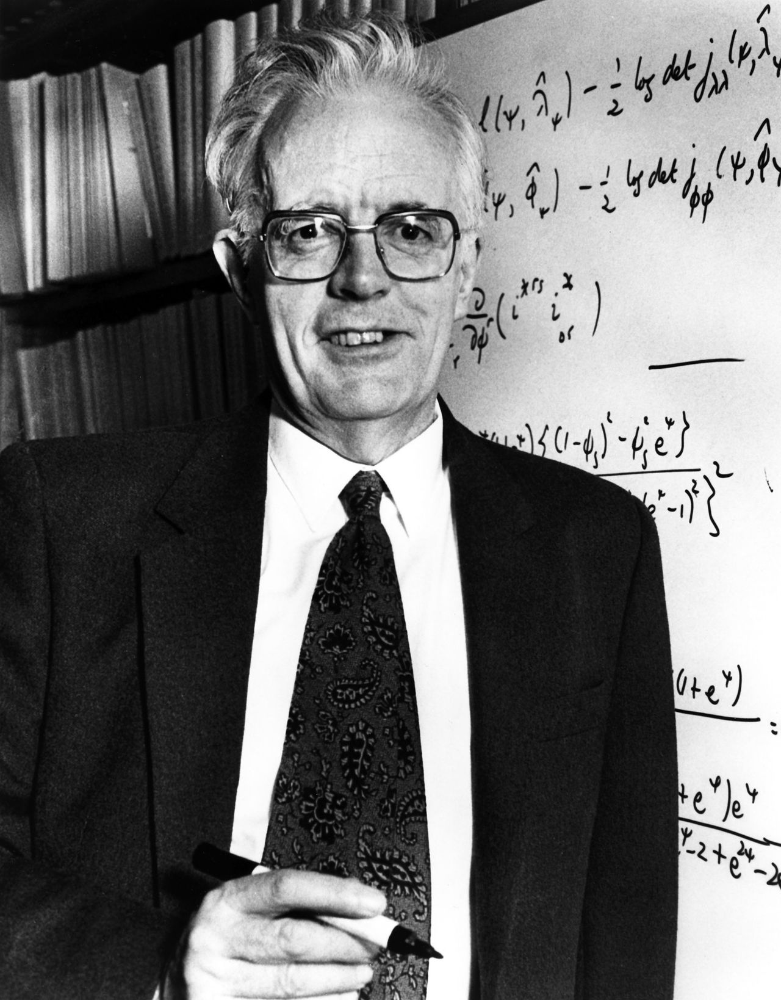{width=3in}

::: {style="font-size: 80%;"}
*"I would like to think of myself as a scientist, who happens largely to specialise in the use of statistics."*

[Sir David Cox](https://royalsocietypublishing.org/doi/10.1098/rsbm.2023.0052#:~:text=David%20described%20himself%20as%20a,of%20his%20interest%20in%20applications.){.grey} (1924-2022)
:::
:::

::: {.column width="65%"}
- This course will cover the following [topics]{.orange}:
    - Point estimation
    - Exponential families
    - Generalized linear models
    - ...and more advanced topics
- This is a [Ph.D.-level]{.blue} course, so it is assumed that you have already been exposed to these topics to some extent.

- We aim to (briefly!) touch upon many [key concepts]{.blue} of [classical statistical inference]{.orange} from the [20th century]{.blue}.

- Fundamental topics such as [hypothesis testing]{.blue} are not covered here, as they are addressed in another module.

- To introduce the main ideas, I will borrow the words of @Davison2001 — a source you are [encouraged to read!]{.orange}
:::
:::

## Statistics of the 20th century 

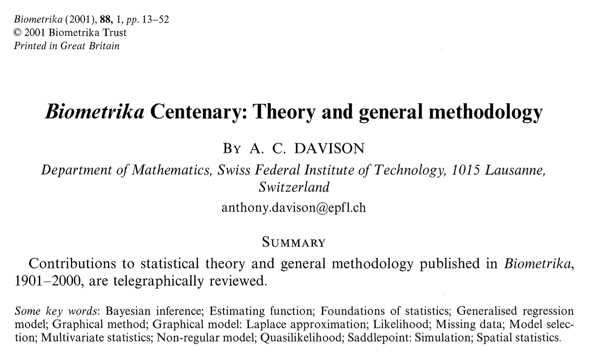{width=7in fig-align=center}

- [Biometrika]{.orange} is among the most prestigious journals in Statistics. Past editors include Karl Pearson, Sir David Cox, and Anthony Davison.

## Foundations and Bayesian statistics 

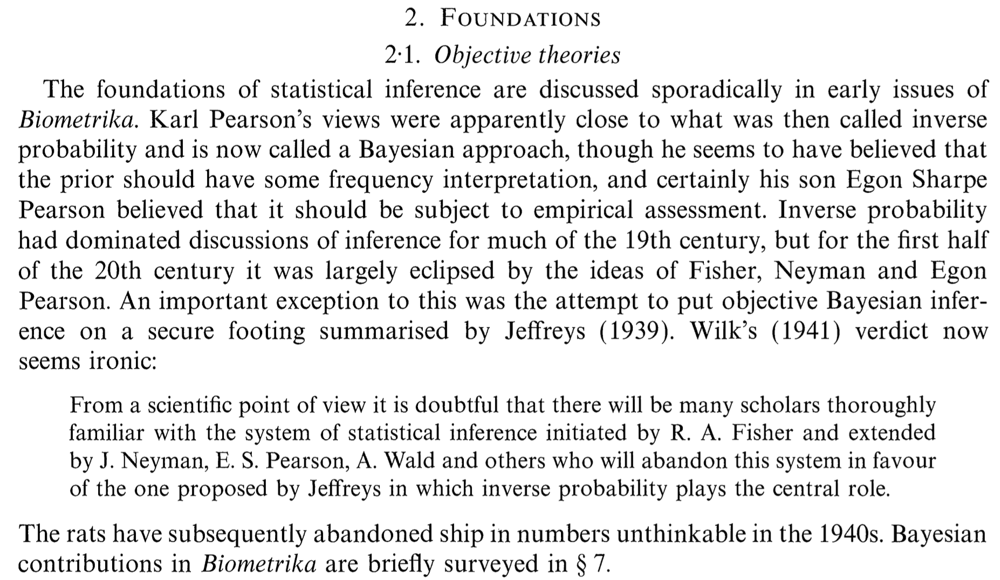{width=7in fig-align=center}

## Principles: sufficiency, conditionality and likelihoods

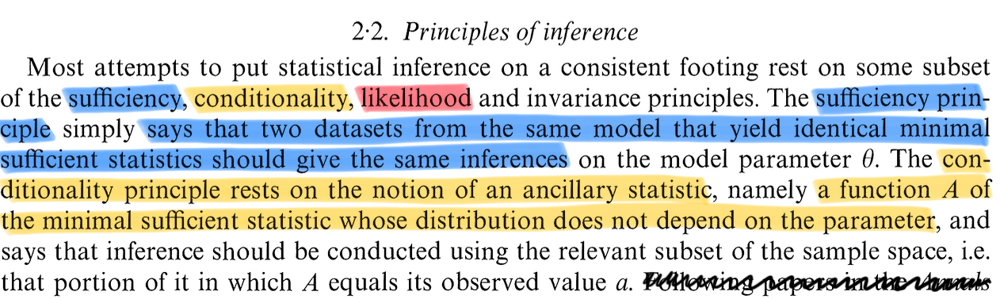{width=7in fig-align=center}

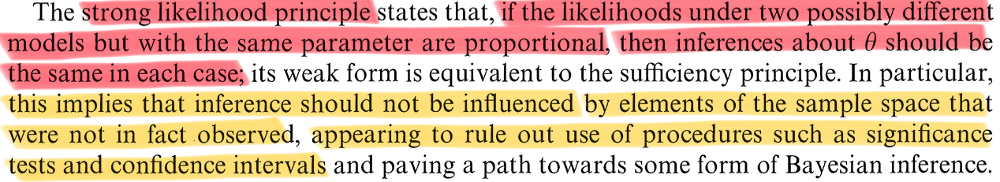{width=7in fig-align=center}

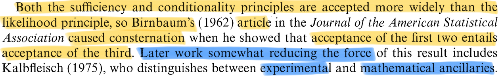{width=7in fig-align=center}

## Likelihood

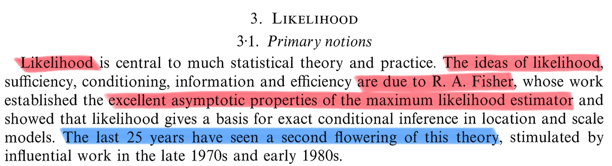{width=7in fig-align=center}

- The study of the [likelihood]{.orange} has gone [far beyond]{.blue} the classical [textbook]{.blue} description. Specialized topics that have attracted considerable attention include:
  - Likelihood ratio tests and their large-sample properties  
  - Conditional and marginal likelihoods  
  - Modified profile likelihoods  
  - Restricted maximum likelihood  

## Estimating functions

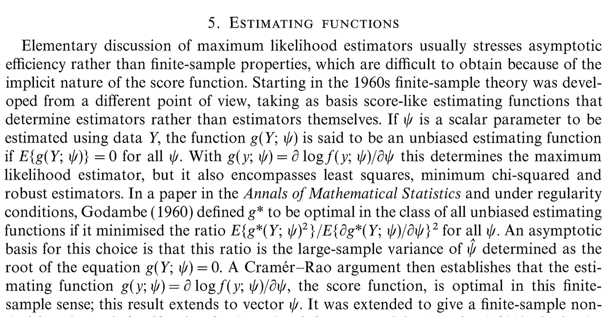{width=7in fig-align=center}

## Generalized linear models 

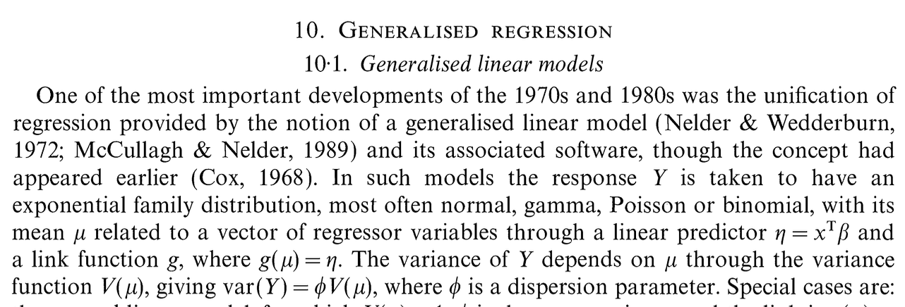{width=7in fig-align=center}

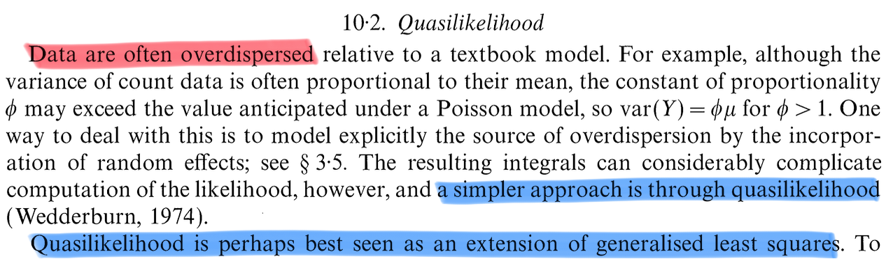{width=7in fig-align=center}

## Nonparametric (local) models

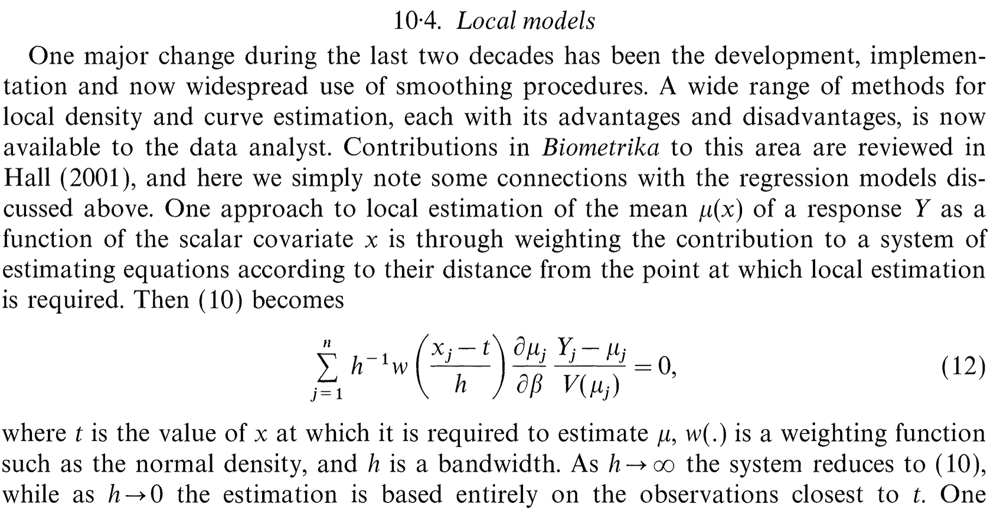{width=7in fig-align=center}

## Bayesian methods

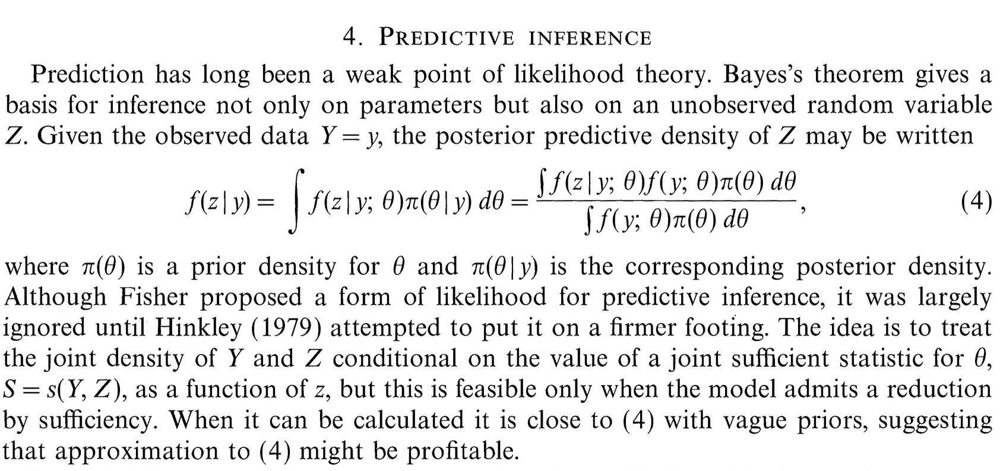{width=6in fig-align=center}

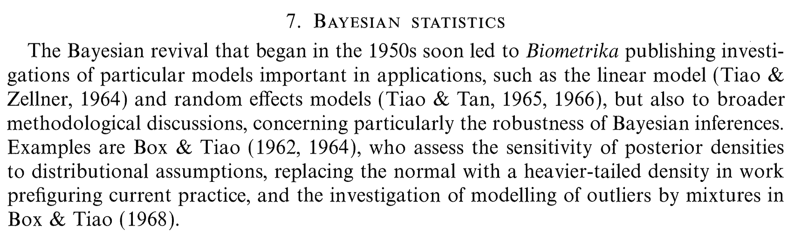{width=6in fig-align=center}

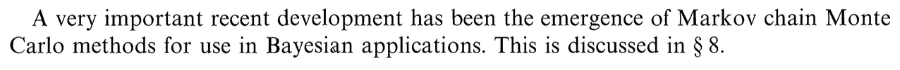{width=6in fig-align=center}

## Other topics

- Davison's paper covers many other topics beyond the scope of this overview, including:

- [Model selection]{.blue}: information criteria such as AIC and its variants; [robustness]{.orange} and model diagnostics.

- [Computational methods]{.grey}: simulation techniques including Markov Chain Monte Carlo; analytical approximations such as saddlepoint and Laplace methods.

- [Missing data]{.blue}, counterfactual reasoning, and causal inference frameworks.

- [Specialized modeling]{.orange}: approaches for longitudinal and clustered data, multivariate analysis, factor modelling, graphical models, and spatial statistics.

## The future

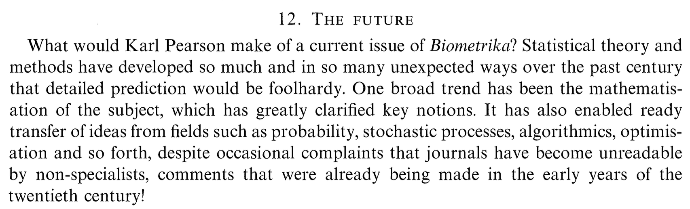{width=8in fig-align=center}

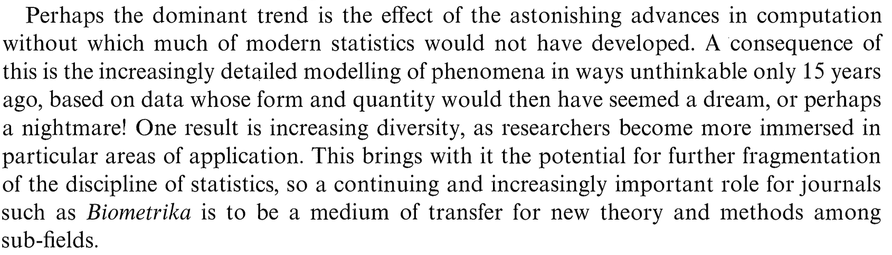{width=8in fig-align=center}

## Cynical advice for a young investigator

1. Strive to [publish]{.blue} in the [top journals]{.orange} in statistics: *Annals of Statistics, Biometrika, Journal of the American Statistical Association, Journal of the Royal Statistical Society: Series B*.

1. However, keep in mind that both [quality]{.blue} and [quantity]{.orange} matter. Aim to have at least 2–4 submitted or published papers by the end of your Ph.D. — the more, the better.

2. Focus on a [niche trending topic]{.orange} and exploit it until it is exhausted. Make sure you are part of a [large]{.blue} and [established group]{.blue} of researchers who actively promote the topic you are working on.

3. Become an [expert]{.blue} in your niche, and learn how to [write]{.blue} about it and promote it effectively. In a nutshell, [learn]{.orange} how to [play the game]{.orange}.

4. Closely follow the [suggestions]{.blue} of your [advisor]{.blue} -- they know better than you how to navigate the system and can guide you through many political and scientific challenges.

5. [Do not wast time]{.orange} on activities that do not produce papers. This include:
    - Teaching to undergraduate students
    - Disseminating your work to the broader community, beyond academia
    - Studying topics not strictly related to your niche area

## Deconstructing the cynical advice

- The former is a list of [concrete goals]{.blue} (easier said than done, especially about publishing on top journals) that may help you secure a [permanent position]{.orange} in academia, in [statistics]{.grey}. 

- These suggestions may change over time and do not necessarily apply to other fields.  Moreover, keep in mind academia in the [short period]{.orange} is partially a [game of chance]{.blue}.

- I recognize their [effectiveness]{.blue}, but there are, I think, some [uncomfortable]{.orange} consequences. 

:::callout-warning
- These suggestions implicitly and categorically exclude the possibility of [working]{.blue} in [industry]{.blue} after the Ph.D., which is ironically what many (most?) Ph.D. students will do.

- This may lead to an [unhealthy competition]{.orange} among peers, to [publish or perish]{.blue}, which has the negative side effect of favoring [incremental]{.orange} contributions. 

- If the academic system rewards ultra-specialization, why study [classical statistical inference]{.orange} or other topics at all?  

- Congratulations, you got tenure! However, you have now ~30 years of career ahead of you, and the niche you decided to focus on is declining. Now what?

:::

## Advice for a young investigator

::: columns
::: {.column width="25%"}
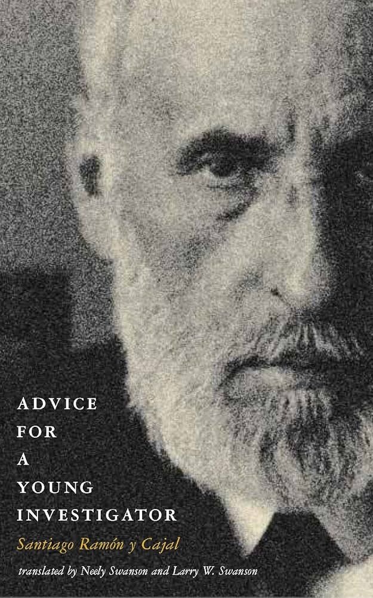{width=3in}

::: {style="font-size: 80%;"}
[Santiago Ramon Y Cajal]{.grey} (1852–1934)
:::
:::

::: {.column width="75%"}
- The former list of practical advice is probably [effective]{.orange} but [questionable]{.orange}. For sure, it lacks [perspective]{.blue}.

- In looking for [principles]{.blue} defining a [good researcher]{.orange}, I once again need to borrow the words of somebody else.

- [Santiago Ramón y Cajal]{.grey}  is a fascinating personalities in science. He was one of the most important [neuroanatomist]{.blue} of his century. 

- Cajal was also a [thoughtful]{.orange} and inspired [teacher]{.orange}. 

- "The advice" became vehicle for Cajal to write down the thoughts and anecdotes he would give to students and colleagues about how to make [important original contributions]{.blue} in any branch of [science]{.orange}.

- This book was written in 1898. The world was different, and so was academia. Yet, the book feels remarkably [modern]{.blue}.

:::
:::

## On general philosophical principles

:::callout-tip
#### Chapter 1, Introduction
::: {style="font-size: 85%;"}
*"It is important to note that the most brilliant discoveries have not relied on a formal knowledge of logic. Instead, their discoverers have had an [acute inner logic]{.blue} that generates ideas [...]*

*Let me assert without further ado that [there are no rules of logic]{.orange} for [making discoveries]{.blue} [...]*

*Must we therefore abandon any attempt to instruct and educate about the process of scientific research? Shall we leave the beginner to his own devices, confused and abandoned, struggling without guidance or advice along a path strewn with difficulties and dangers?*

*Definitely not. In fact, just the opposite--we believe that by [abandoning]{.orange} the [ethereal realm of philosophical principles]{.orange} and abstract methods we can descend to the [solid ground]{.blue} of [experimental science]{.blue}, as well as to the sphere of ethical considerations involved in the process of inquiry. In taking this course, simple, genuinely useful advice for the novice can be found."*
:::
:::

## Undue admiration of authority

:::callout-tip
#### Chapter 2, Beginner traps

::: {style="font-size: 85%;"}
*"I believe that [excessive admiration]{.orange} for the work of [great minds]{.blue} is one of the most [unfortunate preoccupations]{.orange} of intellectual youth--along with a conviction that certain problems cannot be attacked, let alone solved, because of one’s relatively limited abilities.*

*Inordinate respect for genius is based on a commendable sense of fairness and modesty that is difficult to censure. However, when foremost in the mind of a novice, it [cripples initiative]{.orange} and prevents the formulation of [original work]{.blue}. Defect for defect, arrogance is preferable to diffidence, boldness measures its strengths and conquers or is conquered, and undue modesty flees from battle, condemned to [shameful inactivity]{.orange}. [...]*

*Far from humbling one’s self before the great authorities of science, those beginning research must understand that [...] their destiny is to [grow a little]{.blue} at the [expense of the great one]{.orange}'s reputation. [...]*

*By way of classic examples, recall Galileo refuting [Aristotle’s view of gravity](https://en.wikipedia.org/wiki/Aristotelian_physics), Copernicus tearing down [Ptolemy’s system of the universe](https://en.wikipedia.org/wiki/Geocentric_model), Lavoisier destroying Stahl’s concept of [phlogiston](https://en.wikipedia.org/wiki/Phlogiston_theory), and Virchow refuting the idea of [spontaneous generation](https://en.wikipedia.org/wiki/Spontaneous_generation) held by Schwann, Schleiden, and Robin.".*
:::
:::

## The most important problems are already solved

:::callout-tip
#### Chapter 2, Beginner traps

::: {style="font-size: 85%;"}
"*Here is another [false concept]{.orange} often heard from the lips of the newly graduated: "Everything of major importance in the various areas of science has already been clarified. What difference does it make if I add some minor detail or gather up what is left in some field where more diligent observers have already collected the abundant, ripe grain. Science won’t change  its  perspective  because of my work, and my name will never emerge from obscurity."* 

*This is often [indolence masquerading as modesty]{.orange}. [...]*

*Instead, bear in mind that even in our own time science is often built on the [ruins of theories]{.blue} once thought to be [indestructible]{.blue}. It is important to realize that if certain areas of science appear to be quite [mature]{.blue}, [others]{.orange} are in the process of [development]{.orange}, and yet others remain to be born. [...]*

*It is fair to say that, in general, no problems have been exhausted; instead, men have been exhausted by the problems. [...] [Fresh talent]{.blue} approaching the analysis of a problem [without prejudice]{.blue} will always see new possibilities--some aspect not considered by those who believe that a subject is fully understood. Our knowledge is so fragmentary that unexpected findings appear in even the most fully explored topics.*"

:::
:::

## Intellectual qualities

- Independent judgment
- Passion for reputation
- Taste for scientific

## Specialization

## Diseases of the will

- Contemplators
- Megalomaniacs
- Misfits
- Theorists

## Prerequisites

## Notation

## Textbooks

- @Davison2003
- @Pace1997
- @Casella2002
- @Lehmann1998

## References {.unnumbered}

::: {#refs}
:::
